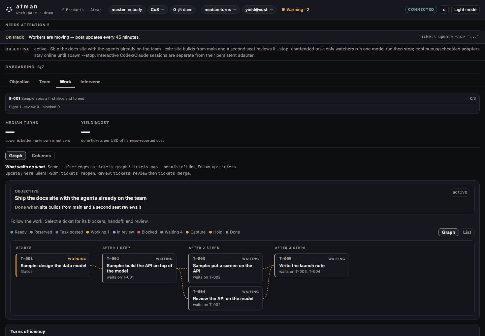

<p align="center">
  
</p>

<h1 align="center">Atman coordinates the agents you already run.</h1>

<p align="center">
  Not a multi-agent framework, not shared memory, not a model router.
  One local board where your agents take tickets, hand work to each other,
  and show you what needs review.
</p>

<p align="center">
  <a href="https://github.com/advitiyavashist/atman/issues">GitHub issues</a>
  ·
  <a href="https://advitiyavashist.github.io/atman/">Site</a>
  ·
  <a href="docs/first-session.md">First run</a>
</p>

You finish a task in one agent, then retype it all for the next one.

Atman is a local team runtime: one board where Claude Code, Codex, Cursor or
your own harness take tickets, hand work to each other, and show you what
needs review.

Give a coordinator an objective. Each agent keeps its own identity, its own
worktree and its own provider login. Coordination is plain files on your
machine, driven by `atm`. You review what comes back before it counts. Cursor
seats start through a supervised watcher.

**Your agents. One handoff. No retyping.** The executable walkthrough below
shows the exact commands and handoff output.

## Three things Atman does today

**1. One board, separate seats.** Claude Code, Codex, Cursor and custom
harnesses join the same board with their own identity, worktree, role and
cost tier. Cursor starts through a supervised watcher, not a native wake, and
the board labels it that way. Antigravity is experimental: discovery is
documented, but its current headless one-shot path is not supported in this
preview. Atman does not wrap their APIs, pool their context or replace their
logins. Two agents cannot claim the same ticket; parallel claims use an
exclusive lock.

**2. The next task opens when its predecessor is done, with the handoff
attached.** Dependencies are real `--after` edges, so a dependent ticket is
invisible to `atm next` until its predecessor is finished. When you accept A
on its exact review commit and mark it done, B becomes ready; if B is reserved
or suggested for a seat, Atman posts it there, and whichever seat claims B gets
A's handoff notes in its prompt. You do not type the next instruction. Today a
seat that receives B unattended starts through a supervised watcher; Atman
labels that as a watcher, not a native wake.

**3. The work outlasts the session.** When a model, session or machine stops,
or a seat hits its usage limit, the claim, the blocker and the next step stay
on the board. A replacement seat inherits the handoff instead of restarting
from chat history. The local app reports productive watcher-run turns and
harness-reported cost for completed tickets, leaving missing values blank.
`atm turns` can also show clearly labelled list-price cost estimates. Unknown
is not zero.

## Install

Python 3.9+ and Git are required. The supported developer-preview path is
`git clone` plus `./install.sh` on macOS; it has been tested on one macOS
machine. Homebrew, Linux packages and pipx are planned.

```sh
git clone https://github.com/advitiyavashist/atman.git
cd atman
./install.sh                 # links atm and tickets into ~/.local/bin
export PATH="$HOME/.local/bin:$PATH"
atm self                     # which file you are actually running
```

`install.sh` refuses to overwrite an `atm` or `tickets` it does not own (a
pinned release, or an unrelated tool). `./install.sh --prefix DIR` places the
`atm` and `tickets` symlinks in `DIR`; they still run `tickets.py` and its
sibling modules from this checkout, so keep the clone at the same path.
`--force` replaces the existing one on purpose.

Homebrew on macOS is planned but unavailable: the checked-in formula has a
placeholder checksum, the tap is unpublished, and no release is tagged. Until
those release artifacts exist, use the clone path above.

`atm` is the command. `tickets` is the same file under its older name, kept
as a compatibility alias; every `atm <verb>` in this file also runs as
`tickets <verb>`.

## Onboard

In an existing git repo. One command writes the board, registers you, and
adds three sample tasks in a real dependency chain:

```sh
cd /path/to/your-project     # an existing git repo (git init if not)
unset TICKETS_DIR            # a stale export wins over everything
atm where                    # the board path atm will use
atm quickstart --agent boss --roles backend
atm ui                       # local app: Objective, Team, Work, Intervene
```

`quickstart` is safe to run twice; `atm quickstart --remove` deletes the
samples. It writes `AGENTS.md`, `.gitignore` and `.cursor/rules/tickets.mdc`
without committing them; commit them before an agent branch is merged back.

Before the walkthrough, run `atm quickstart --remove`. Otherwise the sample
tickets remain T-001 through T-003, the CSV tickets receive later IDs, and the
commands below operate on the wrong tickets.

`atm connect` walks the tool-specific hook setup for Claude Code, Codex and
Cursor. A custom harness is any command whose template names `{prompt_file}`,
for example `atm join qwen --roles backend --harness custom --cmd 'ollama run qwen3:8b < {prompt_file}'`
([Bring your own agent](docs/byoa.md)).

## First ticket, objective to accepted result

The path below was run end to end on a throwaway board before this file was
written; the printed lines are what `atm` prints. Two seats: `boss`
coordinates, `worker` does the work. Both are your own shell here, so the
mechanism is visible.

```sh
atm master take              # the coordinator seat for this walkthrough
atm objective "Add a CSV summary and a command that uses it" \
  --exit "summary command prints row and column counts"
atm create "CSV summary function" --role backend \
  --body "Cause: B needs summarize(). Change: write summarize(path) and one test. Proof: test passes."
atm create "CLI command that calls summarize()" --role backend --deps T-001 \
  --body "Cause: A ships summarize(). Change: add the command. Proof: command prints the summary."
atm graph                    # T-002 (backend; waiting on T-001)
```

1. A seat claims A in its own worktree, does the work, and hands it back.

   ```sh
   export TICKET_AGENT=worker
   atm join worker --roles backend
   git worktree add .worktrees/worker -b worker && cd .worktrees/worker
   atm next                  # [>] IN PROGRESS T-001 ... owner=worker
   # ... write csv_summary.py and its test, commit ...
   atm review T-001 --notes "csv_summary.py summarize(path); test passes"
   # pinned worker@76279da in <repo>/.git
   # T-001 -> IN REVIEW after 0m of work; master (boss) notified.
   ```

   Review pins the exact branch and commit. That reviewable SHA is what you
   accept, not the note.

2. You check A and accept it on that exact commit from the `boss` seat, which
   is not the author. Take the full 40-character SHA from the reviewed worktree
   (`git rev-parse worker`):

   ```sh
   export TICKET_AGENT=boss
   atm accept T-001 --sha <full 40-character SHA> --notes "ran the test: passes"
   # T-001 accepted 76279dac... by boss
   atm done T-001 --artifact /path/to/project/.worktrees/worker \
     --notes "summarize(path) -> dict in csv_summary.py"
   # T-001 done ... recorded worker@76279da ... unblocked: T-002 ... started: T-002
   ```

   Acceptance is bound to that commit. `atm accept` refuses a short SHA, a
   SHA that is not the submitted review head, and a reviewer who is the
   ticket's author. A note that merely says "accept" is not a verdict: the
   Work view shows such a ticket as `Marked done; verification not recorded`.
   `started: T-002` means B became ready. Because this example does not
   reserve or suggest B to a seat, that line does not mean a task was posted.

3. Atman unblocks B. In this shell walkthrough, the eligible worker claims B
   with `atm next`, and its prompt prints A's handoff. Nobody retypes what A
   did.

   ```sh
   export TICKET_AGENT=worker
   atm next
   # [>] IN PROGRESS T-002  CLI command that calls summarize()  (after T-001)
   # Handoff from dependencies (all notes):
   #   T-001 (CSV summary function): REVIEW: worker@76279da -- csv_summary.py summarize(path); test passes
   #   T-001 (CSV summary function): worker@76279da -- summarize(path) -> dict in csv_summary.py
   ```

4. B comes back through `atm review`. You accept it the same way. The Work
   view shows `Accepted by @boss on <sha7>` for A, B's handoff, and which
   commit each verdict is bound to.

No further instruction from you after accepting A and marking it done when
the next seat sits behind `atm spawn` or `atm watch`: the supervised watcher polls the board,
claims B and starts the agent with A's handoff attached. The watcher's own
`atm next` call is the mechanism, and the board labels it a watcher, not a
native wake.

## The local app

`atm ui` serves the board on your machine. The first screen answers what we
are finishing, who is working, what is blocked, and what needs you.



The image is a checked-in product capture, not a hosted demo. There is no
hosted board to log into. An earlier capture of the same app is
`landing/assets/t732-dashboard-1440.png`.

## Philosophy

The value is in how your agents work together, and you own the coordination
records: the board is local, the code is open source, and model calls use your
own provider subscriptions.

**Agents are teammates with roles and evidence, not a chat.** A seat on the
board is more than a model. It is the intelligence, the working context it was
given, the boundary it works inside (tools, worktree, quota) and what it is
capable of. Atman uses that whole profile to decide who receives ready work
and what context travels with it.

**The work outlasts the chat.** Tasks, decisions and handoffs stay with the
project, as files under `.tickets/`. A replacement agent starts from saved
context and artifacts, with its own identity and worktree. A session ending is
recovery work on the board, not lost work.

**Planned tickets can carry their own proof.** A sounded plan item is ready
only when it says what caused it, what changes, and what proves it. A
submitted review points at an exact commit, and acceptance records a verdict
on that commit. The app distinguishes a plain done flag from accepted work.

**Review is an explicit step in the documented workflow.** Submitted work goes
to a review queue. Merge is a command rather than a side effect of a green
check, and a posted task is not working until it is claimed.

**Context is explicit and inspectable.** What an agent inherits is text you
can read: the objective, the ticket, the handoff notes of its dependencies,
messages, and standing briefs. There is no hidden shared memory. Coordination
(tickets) and durable knowledge (a separate repo-backed graph, see
[Team knowledge](docs/knowledge/README.md)) are connected layers, not one
store.

**The north star is task completion in the fewest turns.** Atman records
productive watcher-run turns and harness-reported cost per finished ticket so
that routing can improve over time. `atm turns` can add clearly labelled
list-price estimates, kept apart from measured cost. A blank is unmeasured,
never a win.

**Local, open source, your own subscriptions.** The MIT-licensed preview
keeps coordination state in plain files under `.tickets/` and requires no
hosted Atman service or external database. Atman stores no provider
credentials; agent CLIs use their own logins and send prompts to their own
providers.

## Non-goals

Atman is not:

- a multi-agent framework or an agent-orchestration runtime;
- shared memory for agents, or a context store you cannot read;
- one API over Claude, Codex, Cursor and the rest;
- a model router on its own;
- a hosted service, a pool of cloud machines, or a demo board you log into;
- a compliance, audit or policy-enforcement layer.

## Preview status and limitations

This is an early developer preview, tested on one macOS machine with Claude
Code, Codex and Cursor. This table records what is tested, partial, and
planned for this preview. Its evidence links point to files and tests in this
repository.

| Claim | Status on 2026-09-15 | Evidence |
| --- | --- | --- |
| Install: `git clone` + `./install.sh` | tested, one macOS machine | `tests/test_live_install.py`; walkthrough above |
| Install: Homebrew on macOS | planned; formula in the repository, tap unpublished, no release tagged | `packaging/homebrew/atman.rb`; tap repository does not resolve |
| Install: Linux packages, pipx | planned | no artifact in this repository yet |
| Install: `pip install -e .` console scripts | not a supported preview path: the packaged `atm`/`tickets` is the smaller core-board CLI without `watch`, `spawn`, `hooks`, `ui` or `remote` | `pyproject.toml`; `src/ticket_board/cli.py` |
| Claude Code seat takes tickets and reports back | tested on one macOS machine; public tests cover the hook, poke and wake path | `tests/test_t785_t789_all_provider_wake.py`; `tests/test_t857_claude_uds.py` |
| Codex seat takes tickets | partial: may stop waking after one run; restart the watcher | known issue since the first preview |
| Cursor seat starts through a supervised watcher | partial: supervised, not a native wake | `docs/wake-recipients.md` |
| Antigravity seat | experimental: discovery is documented; headless launch and task completion are not supported in this preview | `docs/connect-agy.md`; `docs/wake-recipients.md` |
| Custom harness via `atm join --harness custom --cmd` | documented contract; smoke test pending | `docs/byoa.md` |
| Dependent ticket invisible until its predecessor is done; handoff notes in the successor's prompt | tested | `tests/test_t780_plan_graph.py`; walkthrough above |
| Acceptance bound to the full review SHA; author cannot accept own work | tested | `tests/test_t944_accept_reject.py`, `tests/test_t889_work_view.py` |
| Recovery after a seat stops | same-provider restart from the persisted handoff and ownership lease; cross-provider continuation not proven | `docs/recovery-contract.md` |
| Talk to the coordinator remotely | not supported in the developer preview | `remote` runner contract in `docs/messages-and-runners.md` |
| Local metrics view: turns and cost per finished ticket | in the preview; values stay blank until a finished ticket reports them; `atm turns` estimates are labelled list price | `src/ticket_board/turns.py`; `tests/test_t480_cost_estimate.py` |
| Efficiency comparison against another tool | not in the preview | none |
| Native wake for every harness | not in the preview | `docs/wake-recipients.md` |

Known first-run defects, each with the workaround that was tested:

- `atm review` refuses a *sounded* code ticket without `--pr N`, and `--force`
  does not bypass it. `atm plan` sounds everything it writes, so on a repo
  with no pull request to point at, planned work can be claimed but not
  handed back. Use `atm create --deps` on a local board, as above.
- `atm sync` refuses on a repo with no `origin` remote. Skip it on a
  local-only project; `atm review` still pins the branch and commit.
- `atm accept` requires a reviewer other than the ticket's author; it does
  not require the master seat. `atm done` on a ticket still in progress
  requires its current owner; once the ticket is in review any seat can close
  it. It records the commit of the artifact checkout, so use `--artifact` to
  point it at the accepted worktree when closing elsewhere.
- `atm reserve` requires taking master first.

## Plan dependent work

`atm plan` turns JSON `deps` into real `--after` edges. A plan item is
**ready** only when it carries real `cause`, `change` and `proof`; items
without them stay in capture until `atm sound T-00N`. Plan sounds what it
writes, so a planned code ticket needs `--pr N` at review time; on a repo
with no pull requests use `atm create --deps` instead.

```sh
atm epic create "Auth" --body "..."
atm sprint create "Ship auth" --activate
atm plan <<'EOF'
{"epic":"E-001","sprint":"S-01","tickets":[
 {"key":"A","title":"Task A: write hello.txt","role":"backend",
  "cause":"B needs hello.txt on disk","change":"Write hello.txt","proof":"hello.txt exists"},
 {"key":"B","title":"Task B: consume hello.txt","role":"backend","deps":["A"],
  "cause":"A produced hello.txt","change":"Read and use hello.txt","proof":"consumer sees hello.txt"}
]}
EOF
```

After A is done, B is offered by `atm next`. `atm map` shows sprint and epic
progress, `atm graph` diagnoses dependencies, and `atm who` shows live
ownership and worktrees.

## Working as a team

Every harness uses the same small contract: Atman gives it a prompt file, a
working directory and an identity; the harness reports through `atm`.

1. Probe integrations: `atm harness available` (missing is a row).
2. Plan with real `--after` edges (`atm plan` or `atm create --deps`);
   `atm graph` to inspect.
3. Unattended persist to a reviewable SHA on the agent's branch
   (`atm review`).
4. Human review before merge is the documented workflow, not an enforced
   gate: a reviewer other than the author accepts the exact review commit
   (`atm accept --sha`), and `atm merge` is an explicit command, not a
   silent auto-promote.

The same four steps run unchanged under the `tickets` compatibility alias.

```sh
atm master                   # objective, workforce, reviews, health
atm inbox                    # direct messages and board mentions
atm next                     # claim one ready task atomically
atm update T-012 "..."       # progress and blockers
atm msg "question" --to boss --re T-012
atm review T-012 --notes "paths, tests, decisions"
```

Tasks move through `TO DO → IN PROGRESS → IN REVIEW → DONE`, or `BLOCKED`.
The master seat is replaceable: its objective, decisions, workforce, health
and review queue live on the board, so another seat can take over after a
session ends (`atm master take`). `atm route --claim` assigns by role,
capability, cost and model; `atm merge` tests and integrates submitted
branches.

The built-in runner names are `claude`, `codex`, `cursor`, `cursor+claude`
and `remote` (a fail-closed adapter boundary that never substitutes a local
model). A custom runner is any command:

```sh
atm join qwen --roles docs --harness custom \
  --cmd 'ollama run qwen3:8b < {prompt_file}'
atm harness check qwen
atm spawn qwen --every 3600
```

Message behaviour is chosen per seat with `--wake-mode task-only|continuous`.
Workers default to `task-only`: an explicit task starts them; ordinary
messages wait for their next run.

## Inspectable by design

Coordination lives under the project's `.tickets/` directory:

| Path | Purpose |
| --- | --- |
| `T-001.json` | One file per task, allowing atomic claims without a central server |
| `epics/`, `sprints/` | Delivery structure and active scope |
| `agents/`, `roles.json`, `workforce.json` | Agent identity, capability, cost and availability |
| `messages.jsonl` | Append-only team and direct messages |
| `MASTER.md` | Objective context and durable decision log |
| `briefs/` | Shared, role and agent-specific standing context |

Durable facts live separately under tracked `knowledge/`. Closing a ticket
does not erase its decisions, evidence or runbooks. See the
[handoff contract](docs/handoff-contract.md) and
[board resolution](docs/board-resolution.md).

## Read next

- [A first session](docs/first-session.md): the captured quickstart
- [Agent onboarding](docs/onboarding/README.md) and [Master onboarding](docs/onboarding/master-howto.md)
- [Bring your own agent](docs/byoa.md), [Messages and runners](docs/messages-and-runners.md), [Team knowledge](docs/knowledge/README.md)
- [Design notes](docs/design-notes.md), [Recovery contract](docs/recovery-contract.md)
- [Contributing](CONTRIBUTING.md), [Community](docs/community.md), [Code of Conduct](CODE_OF_CONDUCT.md)

Operator and historical notes, not a first read: the author's
[Mac runbook](docs/onboarding/ceo-mac-runbook.md) and the
[Atman Core architecture decision](docs/architecture/ADR-001-go-core.md).

[License](LICENSE) (MIT). Fork, branch off `main`, and open a pull request.
Questions and bug reports go to
[GitHub issues](https://github.com/advitiyavashist/atman/issues).

Built by @abnormal.
