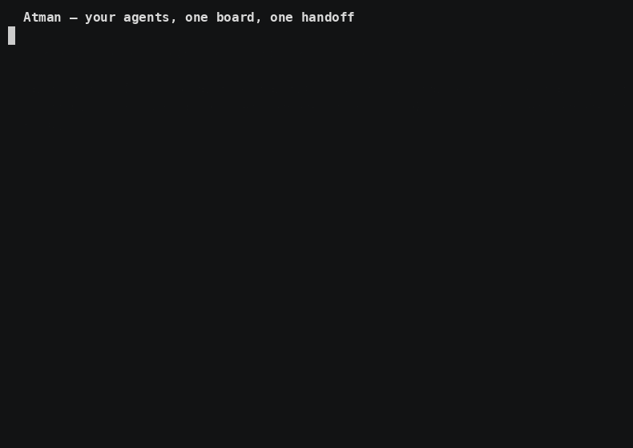

<p align="center">
  
</p>

<p align="center"><b>One Claude Code session does one task at a time, hits its limit mid-task, and forgets the plan by morning. Atman runs your coding agents as a team, on a board in your own repo — where no task starts until another agent has checked the last one.</b></p>

<p align="center">
  
</p>

<p align="center"><a href="https://advitiyavashist.github.io/atman/demo.html">Two-minute deck</a>: one session versus a team, animated. Arrow keys or swipe.</p>

## Why

You give Claude Code a chunk of work. It does the schema, then the API, then
the UI, on Opus, one at a time. Open a second session to go faster and you
become the copy-paste bus between them; each one knows half. Somewhere in the
middle the usage limit lands, and the half-done branch and the reasoning
behind it sit in a chat window. Meanwhile the Codex and Cursor subscriptions
you also pay for do nothing.

Atman makes that session the lead. It writes the tickets with real
dependencies, other seats claim them in parallel, and every decision, handoff
and message lives on the board in your repo. A ticket that stops mid-way is
reopened with its notes and branch for the next seat that claims it
(same-provider recovery is tested; see the [table](#preview-status-and-limitations)).
You put the expensive model where the hard decisions are and the cheap seat
gets the README typo. Nothing lives in a chat window.

## What it does

You give one agent an objective. It writes tickets with real dependencies. Agents
claim them, and each hands work back as a **commit**, not a summary.

Then the part that makes it a team instead of a queue:

1. A worker finishes A and submits it, pinned to an exact commit.
2. **A different agent** — never the author — checks that commit and accepts it.
3. Only then does B open, and B's agent is handed A's accepted commit.

So the next task starts from work someone verified, and a "done" nobody checked
stops the chain instead of quietly feeding the next agent.

Claude Code, Codex and Cursor join the same board, each with its own identity,
worktree and provider login. Atman is a CLI (`atm`) plus a local app
(`atm ui`): the board is plain files under `.tickets/` in your repository —
greppable, diffable, reviewable in a pull request. No hosted service, no
database, no shared memory, and nothing leaves your machine except your agents
talking to their own providers.

<p align="center">
  
</p>

<p align="center"><i>A checked-in capture of the local app. There is no hosted board to log into.</i></p>

## One path

Python 3.9+ and Git. Tested on one macOS machine:
`git clone` plus `./install.sh`. Homebrew, Linux packages and pipx are planned.

```sh
git clone https://github.com/advitiyavashist/atman.git
cd atman
./install.sh                 # links atm and tickets into ~/.local/bin
export PATH="$HOME/.local/bin:$PATH"
atm self                     # which file you are actually running
```

`install.sh` refuses to overwrite an `atm` or `tickets` it does not own.
`./install.sh --prefix DIR` places the symlinks in `DIR`; they still run
`tickets.py` from this checkout. `--force` replaces the existing one on
purpose. `atm` is the command; `tickets` is a compatibility alias.

In an existing git repo. `atm quickstart --remove` first if sample tickets
are still T-001 through T-003 — otherwise the commands below hit the wrong
ids.

```sh
cd /path/to/your-project     # an existing git repo (git init if not)
unset TICKETS_DIR            # a stale export wins over everything
atm where                    # the board path atm will use
atm quickstart --agent boss --roles backend
atm ui                       # local app: Objective, Team, Work, Intervene
```

`quickstart` writes `AGENTS.md`, `.gitignore` and `.cursor/rules/tickets.mdc`
without committing them. Two seats in your own shell: `boss` accepts,
`worker` does the work.

```sh
atm master take
atm objective "Add a CSV summary and a command that uses it" \
  --exit "summary command prints row and column counts"
atm create "CSV summary function" --role backend \
  --body "Cause: B needs summarize(). Change: write summarize(path) and one test. Proof: test passes."
atm create "CLI command that calls summarize()" --role backend --deps T-001 \
  --body "Cause: A ships summarize(). Change: add the command. Proof: command prints the summary."
atm graph                    # T-002 (backend; waiting on T-001)
```

Dependencies are real `--after` edges (`atm create --deps` or `atm plan`).
`atm review` pins a reviewable SHA. Human review is `atm accept --sha`
from a seat that is not the author. `atm harness available` lists each
harness row.

1. Worker claims A, commits, and hands it back.

   ```sh
   export TICKET_AGENT=worker
   atm join worker --roles backend
   git worktree add .worktrees/worker -b worker && cd .worktrees/worker
   atm next                  # [>] IN PROGRESS T-001 ... owner=worker
   # ... write csv_summary.py and its test, commit ...
   atm review T-001 --notes "csv_summary.py summarize(path); test passes"
   # pinned worker@76279da in <repo>/.git
   ```

2. Boss accepts that exact commit, then marks A done. `atm accept` refuses
   a short SHA, a SHA that is not the submitted review head, and the
   ticket's author. Done without that accept leaves T-002 closed.

   ```sh
   export TICKET_AGENT=boss
   atm accept T-001 --sha <full 40-character SHA> --notes "ran the test: passes"
   # T-001 accepted 76279dac... by boss
   atm done T-001 --artifact /path/to/project/.worktrees/worker \
     --notes "summarize(path) -> dict in csv_summary.py"
   # T-001 done ... recorded worker@76279da ... unblocked: T-002
   ```

3. T-002 is now visible to `atm next`. The worker's prompt carries A's
   handoff. Nobody retypes it.

   ```sh
   export TICKET_AGENT=worker
   atm next
   # [>] IN PROGRESS T-002  CLI command that calls summarize()  (after T-001)
   # Handoff from dependencies (all notes):
   #   T-001 ... REVIEW: worker@76279da -- csv_summary.py summarize(path); test passes
   #   T-001 ... worker@76279da -- summarize(path) -> dict in csv_summary.py
   ```

Claude Code, Codex and Cursor join the same board with their own identity,
worktree and provider login. Cursor starts through a supervised watcher,
not a native wake. Codex may stop waking after one run; restart the
watcher. A custom harness is any command whose template names
`{prompt_file}` ([Bring your own agent](docs/byoa.md)).

## Links

[GitHub issues](https://github.com/advitiyavashist/atman/issues)
·
[Site](https://advitiyavashist.github.io/atman/)
·
[Deck](https://advitiyavashist.github.io/atman/demo.html)
·
[A first session](docs/first-session.md)
·
[Agent onboarding](docs/onboarding/README.md)
·
[Master how-to](docs/onboarding/master-howto.md)
·
[Preview status](#preview-status-and-limitations)

## Preview status and limitations

This is an early developer preview, tested on one macOS machine with Claude
Code, Codex and Cursor. This table records what is tested, partial, and
planned for this preview. Its evidence links point to files and tests in this
repository.

| Claim | Status on 2026-09-15 | Evidence |
| --- | --- | --- |
| Install: `git clone` + `./install.sh` | tested, one macOS machine | `tests/test_live_install.py`; walkthrough above |
| Install: Homebrew on macOS | planned; formula in the repository, tap unpublished, no release tagged | `packaging/homebrew/atman.rb`; tap repository does not resolve |
| Install: Linux packages, pipx | planned | no artifact in this repository yet |
| Install: `pip install -e .` console scripts | not a supported preview path: the packaged `atm`/`tickets` is the smaller core-board CLI without `watch`, `spawn`, `hooks`, `ui` or `remote` | `pyproject.toml`; `src/ticket_board/cli.py` |
| Claude Code seat takes tickets and reports back | tested on one macOS machine; public tests cover the hook, poke and wake path | `tests/test_t785_t789_all_provider_wake.py`; `tests/test_t857_claude_uds.py` |
| Codex seat takes tickets | partial: may stop waking after one run; restart the watcher | known issue since the first preview |
| Cursor seat starts through a supervised watcher | partial: supervised, not a native wake | `docs/wake-recipients.md` |
| Antigravity seat | experimental: discovery is documented; headless launch and task completion are not supported in this preview | `docs/connect-agy.md`; `docs/wake-recipients.md` |
| Custom harness via `atm join --harness custom --cmd` | documented contract; smoke test pending | `docs/byoa.md` |
| Dependent ticket stays closed until its predecessor is accepted on the full review SHA by a seat other than the author; handoff notes then appear in the successor prompt | tested | `tests/test_t1031_accept_gate.py`; `tests/test_t944_accept_reject.py`; `tests/test_t780_plan_graph.py`; walkthrough above |
| Acceptance bound to the full review SHA; author cannot accept own work | tested | `tests/test_t944_accept_reject.py`, `tests/test_t889_work_view.py` |
| Recovery after a seat stops | same-provider restart from the persisted handoff and ownership lease; cross-provider continuation not proven | `docs/recovery-contract.md` |
| Talk to the coordinator remotely | not supported in the developer preview | `remote` runner contract in `docs/messages-and-runners.md` |
| Local app: `atm ui` | in the preview; the board stays on this machine; no hosted board | walkthrough above |
| Local metrics view: turns and cost per finished ticket | in the preview; values stay blank until a finished ticket reports them; `atm turns` estimates are labelled list price | `src/ticket_board/turns.py`; `tests/test_t480_cost_estimate.py` |
| Efficiency comparison against another tool | not in the preview | none |
| Native wake for every harness | not in the preview | `docs/wake-recipients.md` |

Known first-run defects, each with the workaround that was tested:

- `atm review` refuses a *sounded* code ticket without `--pr N`, and `--force`
  does not bypass it. `atm plan` sounds everything it writes, so on a repo
  with no pull request to point at, planned work can be claimed but not
  handed back. Use `atm create --deps` on a local board, as above.
- `atm sync` refuses on a repo with no `origin` remote. Skip it on a
  local-only project; `atm review` still pins the branch and commit.
- `atm accept` requires a reviewer other than the ticket's author; it does
  not require the master seat. `atm done` on a ticket still in progress
  requires its current owner; once the ticket is in review any seat can close
  it. It records the commit of the artifact checkout, so use `--artifact` to
  point it at the accepted worktree when closing elsewhere.
- `atm reserve` requires taking master first.

## Read next

- [A first session](docs/first-session.md)
- [Agent onboarding](docs/onboarding/README.md) and [Master onboarding](docs/onboarding/master-howto.md)
- [Bring your own agent](docs/byoa.md), [Messages and runners](docs/messages-and-runners.md), [Team knowledge](docs/knowledge/README.md)
- [Recovery contract](docs/recovery-contract.md)
- [Contributing](CONTRIBUTING.md), [Community](docs/community.md), [Code of Conduct](CODE_OF_CONDUCT.md)

Operator and historical notes, not a first read: the author's
[Mac runbook](docs/onboarding/ceo-mac-runbook.md) and the
[Atman Core architecture decision](docs/architecture/ADR-001-go-core.md).

[License](LICENSE) (MIT). Fork, branch off `main`, and open a pull request.
Questions and bug reports go to
[GitHub issues](https://github.com/advitiyavashist/atman/issues).
