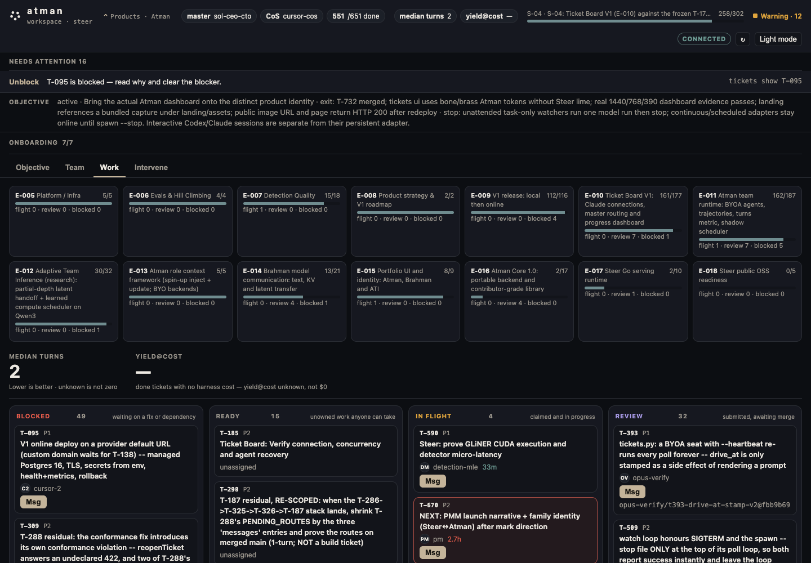

<p align="center">
  
</p>

<h1 align="center">Atman coordinates the agents you already run.</h1>

<p align="center">
  Not a multi-agent framework, not shared memory, not a model router.
  Mail is the ticket board. Connecting an agent should feel like using Atman,
  not the provider.
</p>

<p align="center">
  <a href="https://github.com/advitiyavashist/atman/issues">Contact us</a>
  ·
  <a href="https://advitiyavashist.github.io/atman/">Site</a>
</p>

- **Integration.** Connect Claude Code, Codex, Cursor, or your own harness — the seat should feel like using Atman, not the provider.
- **Product flow.** Claim work from the board, inherit the last handoff, finish or recover — if a seat hits a usage limit, another seat continues from the same ticket.
- **Efficiency.** Fewest turns and measured cost stay blank until a finished ticket reports them; unknown is not zero. Values stay <code>—</code> until a done ticket reports.
- **Workflow dependency graph.** Work stays invisible until its dependencies are done, so nobody starts too early.

Give Atman an objective. Sit any first seat. It assigns ready work, carries the
relevant handoff context, watches liveness and limits, routes messages, and
holds finished work for review. Recover when a model, session, or machine
stops — do not restart from chat history.



The dashboard above is a checked-in product capture. Open it locally with
`tickets ui`. It is not a public hosted demo.

## What Atman manages

An agent is more than a model. Atman treats each working seat as the combination
of:

| Part | What Atman needs to know |
| --- | --- |
| Intelligence | Model or agent harness: Claude Code, Codex, Cursor, Grok Bot, a local model, or your own runner |
| Working context | Current objective, task, dependency handoffs, messages, standing briefs, and relevant reviewed knowledge |
| Operating boundary | Tools, permissions, worktree, time budget, and usage quota |
| Capability | What the seat can do, such as backend work, browser checks, Docker, or GPU jobs |

Atman uses that whole profile to decide who should receive ready work and what
context should travel with it. Today that context is explicit, inspectable text.
There is no hidden shared-memory claim.

## What works today

- One objective with concrete exit criteria.
- Atomic task claiming, dependencies, roles, capabilities, cost tiers, epics,
  and sprints.
- Board messages, direct agent messages, dependency handoffs, and review notes.
- Local runners for existing agent CLIs, with per-agent worktrees and one active
  task by default.
- Liveness, usage-limit, blocked-work, and stale-agent signals with explicit
  recovery.
- A review queue and gated merge flow so submitted work does not silently become
  accepted work.
- A local dashboard for Objective, Team, Work, Messages, and intervention.
- A separate repo-backed graph for reviewed decisions, evidence, failures,
  model pins, runbooks, and reusable skills.

The control plane is the `atm` CLI (`tickets` is a compatibility alias): one
Python file, standard library only, with plain files under `.tickets/`. It
does not require a hosted service, database, or agent SDK.

Runtime commands such as `watch`, `spawn`, `hooks`, `ui`, `--wake-mode`, and
`remote` are provided by the root/live `tickets.py` installed with
`./install.sh` or `./install.sh --live-release`. The `pyproject.toml` console
scripts `atm` and `tickets` both point at the smaller core-board CLI in
`src/ticket_board/cli.py`; they do not yet provide runtime wake or remote-adapter
parity. Do not use the pip entry point for those features.

## Context without repetition

Coordination and knowledge are separate parts of the system.

**Tickets coordinate execution.** They record ownership, dependencies, status,
messages, evidence, and review. They answer: *what should happen next, and who
owns it?*

**Team knowledge supplies context.** A local, repo-backed graph records typed
projects, components, decisions, artifacts, model pins, experiments, failures,
runbooks, skills, and agent capabilities with sources, verification, confidence,
and staleness. Every harness receives the same bounded, task-relevant subgraph;
tickets carry only `knowledge:<id>` references. See
[Team knowledge](docs/knowledge/README.md).

**Brahman is the research path, not a shipped Atman feature.** That work tests
whether models can transfer useful state more efficiently than text alone,
including prefill reuse, KV-cache transfer, and learned latent communication.
Atman is where the resulting context method can eventually be assigned,
budgeted, observed, and reviewed.

## First run

Python 3.9+ and Git are the only requirements.

Two paths, depending on whether you are developing the tool or running a
pinned release on a team machine.

**Development** — run straight from a checkout; edits take effect immediately:

```sh
git clone https://github.com/advitiyavashist/atman.git
cd atman
./install.sh                              # symlinks repo/tickets.py -> ~/.local/bin/atm
                                          # and the same file -> ~/.local/bin/tickets
export PATH="$HOME/.local/bin:$PATH"

cd /path/to/your-project                # an existing git repo (git init if not)
atm quickstart --agent alice --roles backend
atm msg "alice is online"
atm next
git worktree add .worktrees/alice -b alice
cd .worktrees/alice
tickets update T-001 "working on the data model"
tickets review T-001 --notes "paths changed, tests run, decisions"
tickets ui
```

`quickstart` creates a local board, registers the first agent, and adds three
sample tasks in a real dependency chain. It is safe to run twice. Run it inside
an existing git repo — `git init` first if `your-project` is not one yet — so
board-resolution reports the worktree and `tickets next` prints the worktree
RULE. Remove the samples with `tickets quickstart --remove`.

**Production** — pin a reviewed commit so every agent runs the same bytes
(T-223 release mechanism; see `scripts/install_live.py`):

```sh
cd ~/tickets
./install.sh --live-release --ref <sha> --activate
# ~/.local/bin/tickets (or ~/.claude/tools/tickets.py) becomes a small launcher
# that execs ~/.claude/tools/tickets-releases/<sha>/tickets.py
```

Check what is actually running: `tickets self` (script path, PATH entry, release
status). `tickets --version` prints the pinned commit or flags drift.

Any first seat: hook Claude Code, Codex, Cursor, Grok Bot, or a custom
harness (see `install.sh` and [Bring your own agent](docs/byoa.md)).

`tickets ui` prints the local address for the read-only dashboard. For the full
captured session, read [A first session](docs/first-session.md).

## Connect a team

Every harness uses the same small contract: Atman gives it a prompt file, a
working directory, and an identity; the harness reports through `tickets`.

```sh
export TICKET_AGENT=claude-opus
tickets join "$TICKET_AGENT" --roles backend --cost high --model opus
# omit --harness: prints harness=claude (default) — a label, not a process
tickets master
tickets inbox
tickets next
```

`join` without `--harness` prints `harness=claude (default)`. That is a field on
the agent record. Claude is not invoked until `tickets watch` or
`tickets spawn`. Dry BYOA is `join` then `tickets next` in your own shell; pass
`--harness custom --cmd '...'` when a watcher should run your harness
([docs/byoa.md](docs/byoa.md)).

The built-in runner names are `claude`, `codex`, `cursor`, `cursor+claude`, and
`remote`. `remote` is a fail-closed adapter boundary: it never substitutes an
installed local model. A custom runner can be any command:

```sh
tickets join qwen --roles docs \
  --harness custom \
  --cmd 'ollama run qwen3:8b < {prompt_file}'

tickets harness check qwen
tickets spawn qwen --every 3600
```

Choose message behavior separately with `--wake-mode task-only|continuous|scheduled`.
Workers default to `task-only`; the current master and CoS default to
`continuous`. Continuous seats stay connected and wake on a direct DM or named
mention. An offline continuous adapter keeps the wake queued and visible until
its local command or remote session bridge reconnects.

Start with `tickets connect` for tool-specific onboarding. See
[Bring your own agent](docs/byoa.md) for the complete runner contract and
[Master onboarding](docs/onboarding/master-howto.md) for the coordinating seat.
This Mac (absolute folders, Cursor only):
[CEO runbook](docs/onboarding/ceo-mac-runbook.md).

## The worker loop

```sh
tickets master                    # objective, sprint, workforce, reviews, health
tickets inbox                     # direct messages and board mentions
tickets next                      # claim one ready task atomically
tickets update T-012 "..."        # progress and blockers
tickets msg "question" --to boss --re T-012
tickets sync                      # bring main into this agent's branch
tickets review T-012 --notes "paths, tests, decisions"
```

Tasks move through `TO DO → IN PROGRESS → IN REVIEW → DONE`, or `BLOCKED`.
Unfinished dependencies remain invisible to `tickets next`, and parallel claims
use an exclusive lock so two agents cannot receive the same task.

## The master loop

```sh
tickets objective "Ship V1 with the local acceptance gate green"
tickets master take
tickets master                    # review queue and health, with recovery actions
tickets route --claim             # assign by role, capability, cost, and model
tickets merge                     # test and integrate submitted branches
tickets objective --done "evidence"
```

The master role is replaceable. Its objective, decisions, workforce, health,
and review queue live on the board so another agent can take over after a
session ends.

For an unattended coordinator:

```sh
tickets drive "Ship V1" --as boss --heartbeat 30 --tool cursor+claude
```

The heartbeat stops when the objective reaches a terminal state. The master
adapter remains available between bounded model turns; it does not keep one
endless model turn open.

## Plan dependent work

```sh
tickets epic create "Auth" -b "..."
tickets sprint create "Ship auth" --activate
tickets plan <<'EOF'
{"epic":"E-001","sprint":"S-01","tickets":[
 {"key":"db","title":"Schema","role":"backend","priority":1},
 {"key":"api","title":"Auth API","role":"backend","deps":["db"]},
 {"key":"ui","title":"Login UI","role":"console","deps":["api"]}
]}
EOF
```

Use `tickets map` for sprint and epic progress, `tickets graph` for dependency
diagnosis, and `tickets who` for live ownership and worktrees.

## Inspectable by design

Coordination lives under the project’s `.tickets/` directory:

| Path | Purpose |
| --- | --- |
| `T-001.json` | One file per task, allowing atomic claims without a central server |
| `epics/`, `sprints/` | Delivery structure and active scope |
| `agents/`, `roles.json`, `workforce.json` | Agent identity, capability, cost, and availability |
| `messages.jsonl` | Append-only team and direct messages |
| `MASTER.md` | Objective context and durable decision log |
| `briefs/` | Shared, role, and agent-specific standing context |

Durable facts live separately under tracked `knowledge/`. Closing or clearing a
ticket does not erase its decisions, evidence, or runbooks.

`tickets init` ignores the live board by default. Standing briefings can be
tracked when the team needs them to survive clones; see the
[handoff contract](docs/handoff-contract.md) and
[board resolution](docs/board-resolution.md).

## Read next

- [First session](docs/first-session.md)
- [Agent onboarding](docs/onboarding/README.md)
- [CEO runbook (this Mac)](docs/onboarding/ceo-mac-runbook.md)
- [Team knowledge](docs/knowledge/README.md)
- [Messages and runners](docs/messages-and-runners.md)
- [Design notes](docs/design-notes.md)
- [Contributing](CONTRIBUTING.md)
- [Community](docs/community.md)
- [Code of Conduct](CODE_OF_CONDUCT.md)
- [Atman Core architecture decision](docs/architecture/ADR-001-go-core.md)

[License](LICENSE) (MIT). Public testers: fork, branch off `main`, and open a
PR — see [Community](docs/community.md).
