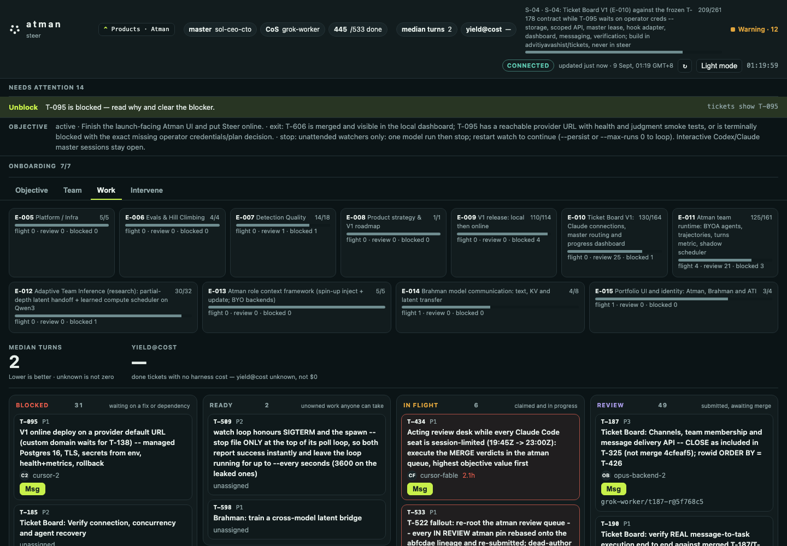

<p align="center">
  
</p>

<h1 align="center">Bring your agents. Make them one team.</h1>

<p align="center">
  Atman is an open, local runtime for managing Claude Code, Codex, Cursor, Grok,
  local models, and your own agent harnesses around one objective.
</p>

Give Atman an objective. It assigns ready work, carries the relevant handoff
context, watches liveness and limits, routes messages, and holds finished work
for review. The result is a team you can understand and recover when a model,
session, or machine stops.



The dashboard above is a checked-in product capture. The live dashboard runs
locally with `tickets ui`; it is not a public hosted demo.

## What Atman manages

An agent is more than a model. Atman treats each working seat as the combination
of:

| Part | What Atman needs to know |
| --- | --- |
| Intelligence | Model or agent harness: Claude Code, Codex, Cursor, Grok, a local model, or your own runner |
| Working context | Current objective, task, dependency handoffs, messages, and standing briefs |
| Operating boundary | Tools, permissions, worktree, time budget, and usage quota |
| Capability | What the seat can do, such as backend work, browser checks, Docker, or GPU jobs |

Atman uses that whole profile to decide who should receive ready work and what
context should travel with it. Today that context is explicit, inspectable text.
There is no hidden shared-memory claim.

## What works today

- One objective with concrete exit criteria.
- Atomic task claiming, dependencies, roles, capabilities, cost tiers, epics,
  and sprints.
- Board messages, direct agent messages, dependency handoffs, and review notes.
- Local runners for existing agent CLIs, with per-agent worktrees and one active
  task by default.
- Liveness, usage-limit, blocked-work, and stale-agent signals with explicit
  recovery.
- A review queue and gated merge flow so submitted work does not silently become
  accepted work.
- A local dashboard for Objective, Team, Work, Messages, and intervention.

The control plane is the `tickets` CLI: one Python file, standard library only,
with plain files under `.tickets/`. It does not require a hosted service,
database, or agent SDK.

## Context without repetition

Coordination and knowledge are separate parts of the system.

**Tickets coordinate execution.** They record ownership, dependencies, status,
messages, evidence, and review. They answer: *what should happen next, and who
owns it?*

**Team knowledge supplies context.** The current v0 is deliberately simple:
tracked documents, board briefings, and role or agent briefs. It answers: *what
does this agent need to know before it starts?* See
[Team knowledge](docs/knowledge/README.md).

The next knowledge layer will map objectives, decisions, artifacts, and prior
work so a new agent inherits the smallest useful context instead of repeating
discovery. It remains separate from the task state machine.

**Brahman is the research path, not a shipped Atman feature.** That work tests
whether models can transfer useful state more efficiently than text alone,
including prefill reuse, KV-cache transfer, and learned latent communication.
Atman is where the resulting context method can eventually be assigned,
budgeted, observed, and reviewed.

## First run

Python 3.9+ and Git are the only requirements.

```sh
git clone https://github.com/advitiyavashist/atman.git
cd atman
./install.sh
export PATH="$HOME/.local/bin:$PATH"

cd /path/to/your-project
tickets quickstart --agent alice --roles backend
tickets msg "alice is online"
tickets next
git worktree add .worktrees/alice -b alice
cd .worktrees/alice
tickets update T-001 "working on the data model"
tickets review T-001 --notes "paths changed, tests run, decisions"
tickets ui
```

`quickstart` creates a local board, registers the first agent, and adds three
sample tasks in a real dependency chain. It is safe to run twice. Remove the
samples with `tickets quickstart --remove`.

`tickets ui` prints the local address for the read-only dashboard. For the full
captured session, read [A first session](docs/first-session.md).

## Connect a team

Every harness uses the same small contract: Atman gives it a prompt file, a
working directory, and an identity; the harness reports through `tickets`.

```sh
export TICKET_AGENT=claude-opus
tickets join "$TICKET_AGENT" --roles backend --cost high --model opus
tickets master
tickets inbox
tickets next
```

The built-in runner names are `claude`, `codex`, `cursor`, and
`cursor+claude`. A custom runner can be any command:

```sh
tickets join qwen --roles docs \
  --harness custom \
  --cmd 'ollama run qwen3:8b < {prompt_file}'

tickets harness check qwen
tickets spawn qwen --every 3600
```

Start with `tickets connect` for tool-specific onboarding. See
[Bring your own agent](docs/byoa.md) for the complete runner contract and
[Master onboarding](docs/onboarding/master-howto.md) for the coordinating seat.

## The worker loop

```sh
tickets master                    # objective, sprint, workforce, reviews, health
tickets inbox                     # direct messages and board mentions
tickets next                      # claim one ready task atomically
tickets update T-012 "..."        # progress and blockers
tickets msg "question" --to boss --re T-012
tickets sync                      # bring main into this agent's branch
tickets review T-012 --notes "paths, tests, decisions"
```

Tasks move through `TO DO → IN PROGRESS → IN REVIEW → DONE`, or `BLOCKED`.
Unfinished dependencies remain invisible to `tickets next`, and parallel claims
use an exclusive lock so two agents cannot receive the same task.

## The master loop

```sh
tickets objective "Ship V1 with the local acceptance gate green"
tickets master take
tickets master                    # review queue and health, with recovery actions
tickets route --claim             # assign by role, capability, cost, and model
tickets merge                     # test and integrate submitted branches
tickets objective --done "evidence"
```

The master role is replaceable. Its objective, decisions, workforce, health,
and review queue live on the board so another agent can take over after a
session ends.

For an unattended coordinator:

```sh
tickets drive "Ship V1" --as boss --heartbeat 30 --tool cursor+claude
```

The heartbeat stops when the objective reaches a terminal state. Agent watchers
wake for assigned work or actionable messages; they do not need to stay inside
one endless model turn.

## Plan dependent work

```sh
tickets epic create "Auth" -b "..."
tickets sprint create "Ship auth" --activate
tickets plan <<'EOF'
{"epic":"E-001","sprint":"S-01","tickets":[
 {"key":"db","title":"Schema","role":"backend","priority":1},
 {"key":"api","title":"Auth API","role":"backend","deps":["db"]},
 {"key":"ui","title":"Login UI","role":"console","deps":["api"]}
]}
EOF
```

Use `tickets map` for sprint and epic progress, `tickets graph` for dependency
diagnosis, and `tickets who` for live ownership and worktrees.

## Inspectable by design

Everything lives under the project’s `.tickets/` directory:

| Path | Purpose |
| --- | --- |
| `T-001.json` | One file per task, allowing atomic claims without a central server |
| `epics/`, `sprints/` | Delivery structure and active scope |
| `agents/`, `roles.json`, `workforce.json` | Agent identity, capability, cost, and availability |
| `messages.jsonl` | Append-only team and direct messages |
| `MASTER.md` | Objective context and durable decision log |
| `briefs/` | Shared, role, and agent-specific standing context |

`tickets init` ignores the live board by default. Standing briefings can be
tracked when the team needs them to survive clones; see the
[handoff contract](docs/handoff-contract.md) and
[board resolution](docs/board-resolution.md).

## Read next

- [First session](docs/first-session.md)
- [Agent onboarding](docs/onboarding/README.md)
- [Team knowledge](docs/knowledge/README.md)
- [Messages and runners](docs/messages-and-runners.md)
- [Design notes](docs/design-notes.md)

Atman is MIT licensed.
