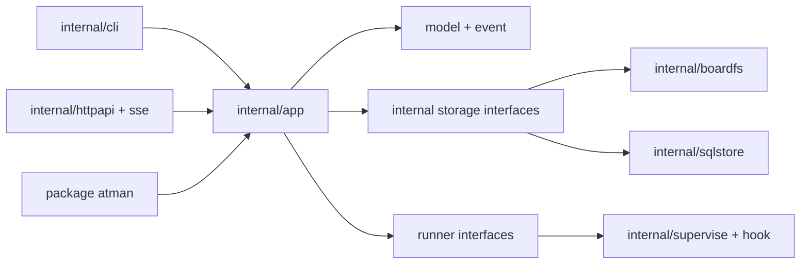

# Atman Core module and public API contract

This document freezes the package boundaries downstream Atman Core tickets
must follow. It describes ownership and dependency direction; method names may
gain detail through the conformance work, but code must not collapse these
boundaries into another monolith.

## Repository map

```text
atman/
├── atman.go                 # package atman: public Runtime facade
├── model/                   # stable records, ids, enums and validation
├── event/                   # stable event, cursor and subscription types
├── runner/                  # public harness adapter contract
├── cmd/atman/               # composition root; no domain logic
├── internal/
│   ├── cli/                 # tickets/atman argv and output adapters
│   ├── app/                 # use cases and transaction boundaries
│   ├── boardfs/             # current .tickets format and atomic file I/O
│   ├── sqlstore/            # server SQLite adapter; one active writer only
│   ├── lock/                # platform lock abstraction
│   ├── outbox/              # committed events, cursors and retention rules
│   ├── graph/               # dependency ordering and cycle checks
│   ├── message/             # mentions, inbox cursors and wake decisions
│   ├── schedule/            # eligibility and deterministic routing
│   ├── supervise/           # child processes, leases and recovery
│   ├── hook/                # harness event normalization and identity pinning
│   ├── gitexec/             # scrubbed, cwd-bound Git subprocesses
│   ├── httpapi/             # frozen OpenAPI request/response adapter
│   └── sse/                 # event log, cursor replay and heartbeats
├── web/                     # embedded output of the existing UI build
├── compat/
│   ├── fixtures/            # language-neutral conformance corpus
│   └── oracle/              # Python invocation/differential test support
├── examples/                # runnable public-API examples
└── docs/architecture/
```

The public root package is `github.com/advitiyavashist/atman`. There is no
`pkg/` directory: packages are public because they are intentionally supported,
not because they happened to sit outside `internal/`.

## Dependency direction



Adapters depend inward on the same application services. The public package is
another deliberate adapter; it is not the route by which internal transports
reach the domain. `internal/app` may depend on narrow storage, clock, process,
and event-sink interfaces. Storage and transport packages must never import CLI
code or call one another. The CLI and HTTP server must not implement state
transitions, mention semantics, dependency checks, or wake policy.

## Supported public API

The root package exposes an in-process runtime. The shape below is the target
contract for T-643/T-649; names are exact enough to prevent competing facades,
while T-642 supplies the complete request fields and validation cases.

```go
package atman

type Options struct {
    BoardDir       string
    Actor          model.AgentID
    RunnerAdapters []runner.Adapter
    Router         Router
}

func Open(ctx context.Context, options Options) (*Runtime, error)

func (r *Runtime) Snapshot(ctx context.Context, filter SnapshotFilter) (Snapshot, error)
func (r *Runtime) CreateTicket(ctx context.Context, request CreateTicketRequest) (model.Ticket, error)
func (r *Runtime) Claim(ctx context.Context, request ClaimRequest) (model.Ticket, error)
func (r *Runtime) Transition(ctx context.Context, request TransitionRequest) (model.Ticket, error)
func (r *Runtime) PostUpdate(ctx context.Context, request UpdateRequest) (model.Update, error)
func (r *Runtime) SubmitReview(ctx context.Context, request ReviewRequest) (model.Review, error)
func (r *Runtime) PostMessage(ctx context.Context, request MessageRequest) (model.Message, error)
func (r *Runtime) Inbox(ctx context.Context, request InboxRequest) (Inbox, error)
func (r *Runtime) Route(ctx context.Context, request RouteRequest) (RouteResult, error)
func (r *Runtime) Subscribe(ctx context.Context, request SubscribeRequest) (*event.Subscription, error)
func (r *Runtime) Close() error
```

`Router` and `runner.Adapter` are the two caller-implemented extension points.
Both receive versioned value objects and a context; neither gets direct store,
process, or transport access. The default router and built-in harness adapters
remain internal. Message bridges use `PostMessage` plus `Subscribe` rather than
an additional plugin system.

Rules for this surface:

- The runtime owns resources it opens and `Close` is idempotent.
- Every blocking or I/O method accepts `context.Context` first.
- Request structs make actor, idempotency key, expected record version, and
  scope explicit where the frozen contract requires them.
- Returned records are values. Callers cannot mutate internal state through a
  pointer retained by the runtime.
- A method either commits its complete state change and event or returns an
  error. A caller never has to infer a partial success from text.
- The public facade is intentionally smaller than the CLI and HTTP surface.
  Administrative transport behavior calls `internal/app` directly and becomes
  public only after a demonstrated embedding use case and an ADR.
- Transport-specific concepts such as HTTP status, CLI color, cookies, and
  environment-variable lookup are absent from the public domain API.

`model` and `event` are stable public packages. `runner` is a versioned
extension point only after its fake-harness conformance suite passes. Every
other package starts internal. Moving a type out of `internal/` requires an ADR
because Go 1 compatibility then makes it a product commitment.

## Storage ownership

Atman has two accepted persistence shapes today: the direct `.tickets` file
board and the server's SQLite store. Both implement one internal transaction
interface. Domain rules live above that interface and are implemented once.

The transaction interface accepts one commit bundle containing state changes,
audit entries, outbox events, the request digest, and the replayable result. It
does not expose separate `Save` and `Publish` operations. That separation would
allow a process to persist a ticket and die before persisting the event that
tells the rest of the team about it.

- `boardfs` preserves current paths and JSON bytes where the conformance
  contract declares byte stability. It remains the default during migration.
- `sqlstore` preserves the frozen server schema, append-only audit behavior,
  request idempotency, and optimistic record versions.
- Exactly one adapter owns a board at a time. The existing server-ownership
  sentinel remains the authority switch. There is no mirrored write path.
- Import and export are explicit commands with receipts. They are not hidden
  inside `Open`.

This is one canonical implementation of behavior with two persistence
adapters, not two implementations of ticket semantics.

## State, event and outbox atomicity

An accepted mutation and the event describing it are one logical transaction.
The application layer passes the storage adapter a `Commit` value with:

- expected record versions or preimage hashes;
- complete state after-images and tombstones;
- ordered audit and outbox event envelopes with stable event ids;
- request id plus canonical request digest when the caller supplied one; and
- the canonical result needed to answer an idempotent retry.

### File-board commit protocol

The file board uses a write-ahead transaction directory. Materialized ticket,
agent, message, and objective files are projections; a durable checkpoint plus
the committed transaction tail is authoritative.

The version-one manifest is canonical JSON with this logical shape. Payloads
are separate files in the same prepared directory, and every reference includes
its byte length and digest.

```json
{
  "schema": 1,
  "transaction_id": "txn_...",
  "sequence": 42,
  "request": {"id": "optional caller id", "sha256": "..."},
  "preconditions": [
    {"path": "T-042.json", "sha256": "existing digest or null"}
  ],
  "mutations": [
    {"op": "replace", "path": "T-042.json", "payload": "state/0001", "bytes": 812, "sha256": "..."}
  ],
  "audit": [
    {"payload": "audit/0001", "bytes": 244, "sha256": "..."}
  ],
  "outbox": [
    {"event_id": "evt_...", "ordinal": 0, "snapshot_version": 42, "payload": "outbox/0001", "bytes": 306, "sha256": "..."}
  ],
  "result": {"payload": "result.json", "bytes": 901, "sha256": "..."}
}
```

Every externally visible state mutation has at least one outbox event. Event
ordinal is unique within a transaction, and `snapshot_version` equals the
transaction sequence. Tombstones use `"op":"delete"` with no after-image.
Manifest paths are board-relative UTF-8 using `/`, cannot contain an empty,
`.` or `..` segment, and cannot traverse a symlink. Unknown manifest versions
are read-only until migrated explicitly.

1. Acquire the one interprocess board-writer lock and recover all earlier
   committed transactions before evaluating preconditions.
2. Allocate the next transaction sequence while holding that lock. Write
   `.tickets/transactions/staging/<transaction-id>.tmp/` on the same filesystem.
   Its manifest names the sequence, preimages, after-images, tombstones,
   request digest, stored result, audit entries, outbox events, and SHA-256 of
   every payload. Paths are normalized and containment-checked before any file
   is opened.
3. Flush every payload and the manifest, then flush the staging directory. A
   missing or invalid checksum makes the transaction uncommittable.
4. Atomically rename the complete directory to
   `.tickets/transactions/committed/<sequence>-<transaction-id>/`, then flush
   the committed parent directory. The rename is the live linearization point;
   the parent flush is the durability barrier, and the service acknowledges the
   commit only after both complete. A crash between them leaves either no
   committed directory or the complete directory, never half of its state and
   outbox payload. After the barrier, both are durable even when no materialized
   file changed.
5. Apply after-images and tombstones in manifest order with content-addressed
   temporary files and atomic replacement. Replay accepts a file already equal
   to its after-image. A file matching neither the recorded preimage nor
   after-image is foreign divergence: quarantine the board and fail closed.
6. After every projection and its directory entry is durable, atomically advance
   `transactions/checkpoint.json` to the applied sequence and return the result
   stored in the commit.

A process killed before step 4 leaves only staging data, which recovery removes.
A process killed at or after step 4 leaves an authoritative committed bundle;
the next `Open`, CLI command, HTTP request, or subscription replays it before
serving state. A post-commit process cannot report a normal mutation failure:
it either returns the stored success result, loses the connection, or places
the board in a visible recovery-required state. It does not accept later writes
until replay succeeds.

Request idempotency is checked under the writer lock against committed bundles
and the materialized index. The same id and digest returns the stored result and
event ids without another commit. The same id with a different digest returns
`request_id_reused`. Without a caller idempotency key, atomicity still holds,
but a caller retry after losing the response is a new operation.

Transaction bundles remain until both the materialized checkpoint covers them
and SSE retention no longer needs their events. Compaction first writes and
flushes a complete snapshot/checkpoint that records the lowest retained event
cursor, then removes covered bundles. A crash during cleanup can only retain
extra bundles; replay remains idempotent. Sequence gaps, corrupt manifests,
missing payloads, or a checkpoint beyond available evidence fail closed.

The checkpoint is canonical JSON containing schema version, applied sequence,
snapshot tree digest, and retained event floor. It advances only after the
entire projection is durable; it cannot be inferred from whichever state files
happen to exist.

Platforms implement durable same-filesystem replacement and directory metadata
flush through explicit platform files. If a target cannot prove the commit
point, Atman reports that writes are unsupported there; it never silently
downgrades the protocol to best effort.

### SQLite commit protocol

The SQLite adapter stores domain row changes, append-only audit rows,
idempotency request/result, and ordered `outbox_events` rows in one database
transaction. The database commit is the only commit point. A rollback exposes
none of them; a committed transaction exposes all of them.

`commits` supplies a monotonic sequence and stores transaction id, optional
request id/digest, canonical result, and timestamp. `outbox_events` has
`(commit_sequence, ordinal)` as its primary key, a unique event id, snapshot
version, event type, scope, and payload. Foreign keys bind outbox and audit rows
to their commit. The existing request log gains a unique reference to the same
commit; it is not an independently committed cache.

SSE and message-wake consumers read committed `outbox_events` by monotonic
sequence. An in-process notification may reduce latency, but it is only a hint:
restart recovery and reconnect always query the durable outbox. Retention may
delete rows only after the snapshot fallback covers their sequence. A retry
after a lost response reads the stored idempotency result rather than applying
the mutation again.

### SSE derivation

File-board SSE enumerates event envelopes from committed transaction bundles;
SQLite SSE enumerates committed outbox rows. Materialized event files and
in-memory channels are caches, never the source of truth. Event ids and snapshot
versions are allocated inside the state transaction. Reconnect delivery is
at-least-once, so clients deduplicate event ids. A committed event is never lost;
when its cursor is older than the retained floor, the server emits the frozen
snapshot-fallback event.

## Concurrency contract

1. Resolve the board once at startup from explicit options, then filesystem
   evidence. Ambient Git location variables never override the selected root.
2. Lock order is board writer lock, then in-process component lock. Code may
   not acquire them in the reverse order. Network calls and child-process waits
   never happen while holding the board writer lock.
3. Each goroutine belongs to a `Runtime`, server, subscription, or supervised
   run. Its owner cancels and joins it. No detached package-level goroutines.
4. Queue bounds and overflow behavior are explicit. Durable outbox data remains
   available when an in-memory queue overflows.
5. Clock and identifier generation are injected interfaces in tests. Production
   uses UTC and monotonic process time for durations.

Portable file locking is isolated in `internal/lock`; callers do not import a
third-party lock package. The adapter must prove kernel release on process exit,
try-lock behavior, and Unix/Windows compatibility before it replaces today's
lock paths.

## Errors

Domain errors carry a stable machine code, operation, safe message, and wrapped
cause. They support `errors.Is`/`errors.As`; callers never match strings.

```go
type Error struct {
    Code      Code
    Operation string
    Message   string
    Cause     error
}
```

- Codes are drawn from the frozen OpenAPI/CLI contract, including
  `ticket_already_claimed`, `dependency_unmet`, `request_id_reused`, and
  `legacy_writer_active`.
- Internal paths, tokens, raw subprocess output, and SQL never enter the safe
  message by default.
- CLI maps codes to frozen exit statuses and stderr text at its boundary.
- HTTP maps the same codes to its frozen JSON envelope and status at its
  boundary.
- A subprocess failure retains argv as a string slice and exit status. It never
  reconstructs a shell command or executes through a shell unless the harness
  contract explicitly declares shell mode.

## Harness and wake boundary

Harness adapters use a language-neutral subprocess protocol. A registration
defines executable argv, environment allowlist, working directory, capability,
default permission profile, event format, and a persisted per-seat wake mode.
The available modes apply equally to Claude, Codex, Cursor, Grok, and custom
harnesses:

| Mode | Durable trigger and execution behavior |
| --- | --- |
| `continuous` | A direct message or explicit `@mention`, an explicit task message, or an assignment creates one immediate wake job. A leased live session takes a turn through its adapter; if offline, the job stays queued and is delivered once after reconnect. |
| `task-only` | An assignment or message marked `--task` creates one immediate bounded run. Ordinary direct messages and mentions remain readable but do not spend a model turn. The run exits after the task turn. |
| `scheduled` | A persistent watcher takes bounded turns only when an external cadence invokes it. Ordinary direct messages and mentions are notify-only until that turn. An assignment or message marked `--task` is explicit cost authorization and creates one immediate wake job. Atman stores the wake mode and durable reasons; it does not own a cron expression or next-run deadline. |

Master and chief-of-staff seats default to `continuous`; other seats default to
`task-only`. These are registration defaults, not role checks in the scheduler.
The user may choose any mode for any seat and may change it with an audited
configuration update. A mode change never drops already durable wake jobs.

One addressed message produces at most one wake job even when it is both a DM
and a mention. Self messages and broadcasts do not create recursive wakes.
Delivery claims one session lease, uses bounded prompt context, pins the durable
agent identity, and records queued, dispatched, acknowledged, failed, and
recovered receipts. If a live harness cannot accept an injected turn, its
adapter reconnects or starts the same seat according to the mode; it does not
silently mark the wake delivered.

Harness-specific code is limited to process launch and event normalization.
Scheduling, deduplication, wake policy, leases, and receipts have one canonical
implementation. The supervisor owns the process group, lease, stdout/stderr
pumps, cancellation deadline, and final receipt.

## Compatibility boundaries

| Surface | Compatibility promise |
| --- | --- |
| `.tickets` paths and accepted JSON | Frozen by T-642 fixtures; additive reads first, versioned writes |
| CLI command, JSON, stdout/stderr, exit code | Exact differential parity until a documented major change |
| `/api/v1` OpenAPI | Existing versioning and error contract |
| SSE ids, replay and snapshot fallback | Existing cursor contract |
| Public Go API | SemVer from the first `v1.0.0` module tag |
| `internal/*` | No compatibility promise |
| Harness subprocess protocol | Version field and capability negotiation |
