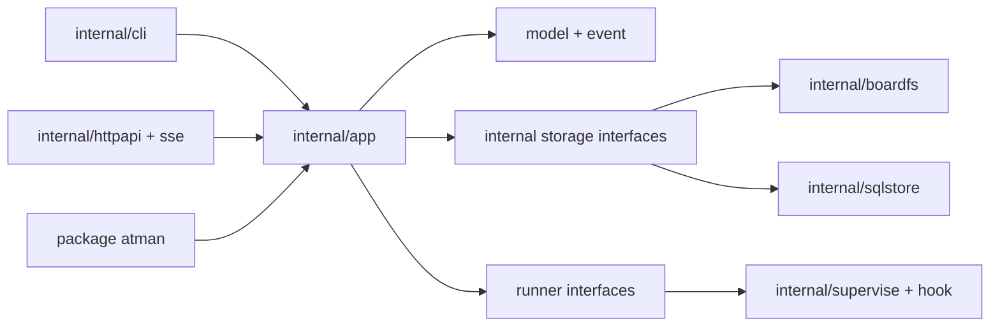

# Atman Core module and public API contract

This document freezes the package boundaries downstream Atman Core tickets
must follow. It describes ownership and dependency direction; method names may
gain detail through the conformance work, but code must not collapse these
boundaries into another monolith.

## Repository map

```text
atman/
├── atman.go                 # package atman: public Runtime facade
├── model/                   # stable records, ids, enums and validation
├── event/                   # stable event, cursor and subscription types
├── runner/                  # public harness adapter contract
├── cmd/atman/               # composition root; no domain logic
├── internal/
│   ├── cli/                 # tickets/atman argv and output adapters
│   ├── app/                 # use cases and transaction boundaries
│   ├── boardfs/             # current .tickets format and atomic file I/O
│   ├── sqlstore/            # server SQLite adapter; one active writer only
│   ├── lock/                # platform lock abstraction
│   ├── graph/               # dependency ordering and cycle checks
│   ├── message/             # mentions, inbox cursors and wake decisions
│   ├── schedule/            # eligibility and deterministic routing
│   ├── supervise/           # child processes, leases and recovery
│   ├── hook/                # harness event normalization and identity pinning
│   ├── gitexec/             # scrubbed, cwd-bound Git subprocesses
│   ├── httpapi/             # frozen OpenAPI request/response adapter
│   └── sse/                 # event log, cursor replay and heartbeats
├── web/                     # embedded output of the existing UI build
├── compat/
│   ├── fixtures/            # language-neutral conformance corpus
│   └── oracle/              # Python invocation/differential test support
├── examples/                # runnable public-API examples
└── docs/architecture/
```

The public root package is `github.com/advitiyavashist/atman`. There is no
`pkg/` directory: packages are public because they are intentionally supported,
not because they happened to sit outside `internal/`.

## Dependency direction



Adapters depend inward on the same application services. The public package is
another deliberate adapter; it is not the route by which internal transports
reach the domain. `internal/app` may depend on narrow storage, clock, process,
and event-sink interfaces. Storage and transport packages must never import CLI
code or call one another. The CLI and HTTP server must not implement state
transitions, mention semantics, dependency checks, or wake policy.

## Supported public API

The root package exposes an in-process runtime. The shape below is the target
contract for T-643/T-649; names are exact enough to prevent competing facades,
while T-642 supplies the complete request fields and validation cases.

```go
package atman

type Options struct {
    BoardDir       string
    Actor          model.AgentID
    RunnerAdapters []runner.Adapter
    Router         Router
}

func Open(ctx context.Context, options Options) (*Runtime, error)

func (r *Runtime) Snapshot(ctx context.Context, filter SnapshotFilter) (Snapshot, error)
func (r *Runtime) CreateTicket(ctx context.Context, request CreateTicketRequest) (model.Ticket, error)
func (r *Runtime) Claim(ctx context.Context, request ClaimRequest) (model.Ticket, error)
func (r *Runtime) Transition(ctx context.Context, request TransitionRequest) (model.Ticket, error)
func (r *Runtime) PostUpdate(ctx context.Context, request UpdateRequest) (model.Update, error)
func (r *Runtime) SubmitReview(ctx context.Context, request ReviewRequest) (model.Review, error)
func (r *Runtime) PostMessage(ctx context.Context, request MessageRequest) (model.Message, error)
func (r *Runtime) Inbox(ctx context.Context, request InboxRequest) (Inbox, error)
func (r *Runtime) Route(ctx context.Context, request RouteRequest) (RouteResult, error)
func (r *Runtime) Subscribe(ctx context.Context, request SubscribeRequest) (*event.Subscription, error)
func (r *Runtime) Close() error
```

`Router` and `runner.Adapter` are the two caller-implemented extension points.
Both receive versioned value objects and a context; neither gets direct store,
process, or transport access. The default router and built-in harness adapters
remain internal. Message bridges use `PostMessage` plus `Subscribe` rather than
an additional plugin system.

Rules for this surface:

- The runtime owns resources it opens and `Close` is idempotent.
- Every blocking or I/O method accepts `context.Context` first.
- Request structs make actor, idempotency key, expected record version, and
  scope explicit where the frozen contract requires them.
- Returned records are values. Callers cannot mutate internal state through a
  pointer retained by the runtime.
- A method either commits its complete state change and event or returns an
  error. A caller never has to infer a partial success from text.
- The public facade is intentionally smaller than the CLI and HTTP surface.
  Administrative transport behavior calls `internal/app` directly and becomes
  public only after a demonstrated embedding use case and an ADR.
- Transport-specific concepts such as HTTP status, CLI color, cookies, and
  environment-variable lookup are absent from the public domain API.

`model` and `event` are stable public packages. `runner` is a versioned
extension point only after its fake-harness conformance suite passes. Every
other package starts internal. Moving a type out of `internal/` requires an ADR
because Go 1 compatibility then makes it a product commitment.

## Storage ownership

Atman has two accepted persistence shapes today: the direct `.tickets` file
board and the server's SQLite store. Both implement one internal transaction
interface. Domain rules live above that interface and are implemented once.

- `boardfs` preserves current paths and JSON bytes where the conformance
  contract declares byte stability. It remains the default during migration.
- `sqlstore` preserves the frozen server schema, append-only audit behavior,
  request idempotency, and optimistic record versions.
- Exactly one adapter owns a board at a time. The existing server-ownership
  sentinel remains the authority switch. There is no mirrored write path.
- Import and export are explicit commands with receipts. They are not hidden
  inside `Open`.

This is one canonical implementation of behavior with two persistence
adapters, not two implementations of ticket semantics.

## Filesystem and concurrency contract

1. Resolve the board once at startup from explicit options, then filesystem
   evidence. Ambient Git location variables never override the selected root.
2. A board mutation acquires the board writer lock, reloads affected records,
   validates preconditions, writes sibling temporary files, calls `Sync`,
   renames, syncs the containing directory where supported, appends the event,
   and releases the lock.
3. SQLite mutations use one database transaction and append the audit/event
   record before commit.
4. Lock order is board writer lock, then in-process component lock. Code may
   not acquire them in the reverse order. Network calls and child-process waits
   never happen while holding the board writer lock.
5. Each goroutine belongs to a `Runtime`, server, subscription, or supervised
   run. Its owner cancels and joins it. No detached package-level goroutines.
6. Queue bounds and overflow behavior are explicit. SSE lag beyond the retained
   cursor range returns the frozen snapshot-fallback event.
7. Clock and identifier generation are injected interfaces in tests. Production
   uses UTC and monotonic process time for durations.

Portable file locking is isolated in `internal/lock`; callers do not import a
third-party lock package. The adapter must prove kernel release on process exit,
try-lock behavior, and Unix/Windows compatibility before it replaces today's
lock paths.

## Errors

Domain errors carry a stable machine code, operation, safe message, and wrapped
cause. They support `errors.Is`/`errors.As`; callers never match strings.

```go
type Error struct {
    Code      Code
    Operation string
    Message   string
    Cause     error
}
```

- Codes are drawn from the frozen OpenAPI/CLI contract, including
  `ticket_already_claimed`, `dependency_unmet`, `request_id_reused`, and
  `legacy_writer_active`.
- Internal paths, tokens, raw subprocess output, and SQL never enter the safe
  message by default.
- CLI maps codes to frozen exit statuses and stderr text at its boundary.
- HTTP maps the same codes to its frozen JSON envelope and status at its
  boundary.
- A subprocess failure retains argv as a string slice and exit status. It never
  reconstructs a shell command or executes through a shell unless the harness
  contract explicitly declares shell mode.

## Harness boundary

Harness adapters use a language-neutral subprocess protocol. A registration
defines executable argv, environment allowlist, working directory, capability,
permission profile, and event format. The supervisor owns the process group,
lease, stdout/stderr pumps, cancellation deadline, and final receipt.

Claude, Codex, Cursor, Grok, and custom agents are configurations plus thin
event normalizers. They do not become separate copies of scheduling or wake
logic. Persistent master and CoS sessions use the same supervisor with an
explicit continuous policy; ordinary workers default to one task-bound run.

## Compatibility boundaries

| Surface | Compatibility promise |
| --- | --- |
| `.tickets` paths and accepted JSON | Frozen by T-642 fixtures; additive reads first, versioned writes |
| CLI command, JSON, stdout/stderr, exit code | Exact differential parity until a documented major change |
| `/api/v1` OpenAPI | Existing versioning and error contract |
| SSE ids, replay and snapshot fallback | Existing cursor contract |
| Public Go API | SemVer from the first `v1.0.0` module tag |
| `internal/*` | No compatibility promise |
| Harness subprocess protocol | Version field and capability negotiation |
