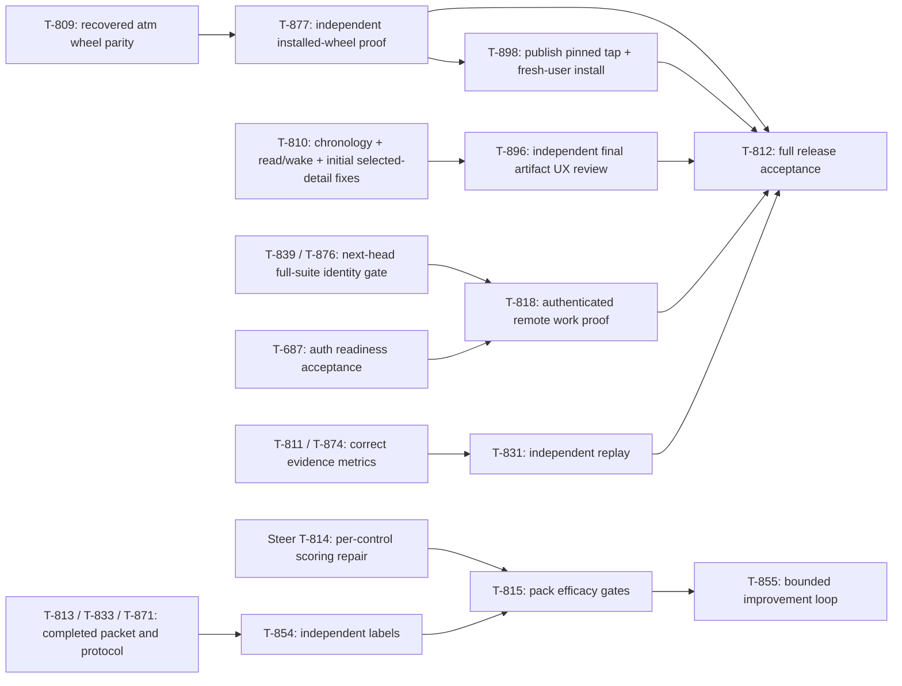

# Interim CEO launch desk — T-897

Operator decision, September 13: Sol takes interim CEO/master while Claude
leadership is session-limited. Runtime identity remains
`sol-planner-codex-0913`; no second Sol session or approval desk is introduced.
Previous CEO: `atman-ceo-opus-0913`. Previous CoS:
`atman-cos-sonnet-watch-0913`, currently quota-paused. Return leadership through
an explicit, recorded handoff after recovery; do not rely on old role names or
inbox read as proof of availability.

## Objective and product bar

Atman public September 18: primary `atm` CLI with `tickets` compatibility;
one coherent local app showing objective, terminal criteria, dependency work,
distinct teammates, review and message evidence; supported authorized wake
without operator keystrokes; executable README and initial truthful scorecard.
Steer releases only named policy packs/controls whose independently labeled
efficacy passes the accepted gates. No NER flip, self-approved compliance,
unmeasured savings claim or experiment that blocks launch.

Atman is the team runtime for agents users bring, not a Steer policy clone.
Keep formation dots, lowercase wordmark, flat charcoal/brass identity and
compact Work/Team/message surfaces. First Work screen answers what finishes,
what waits, and who is next. Evidence distinguishes reserved, posted, read,
woken, claimed, reviewed and accepted. Research/portfolio chrome is secondary.

## Current execution graph

This is the execution/acceptance relationship, not proof every drawn edge has
already been edited into the live board. The board remains authoritative.
Do not create a second ticket registry or duplicate the existing units.

## Active owners and endpoints

- **App:** `atman-ui-t810-cursor-0913`, unique author. T-810 correction is
  IN REVIEW at PR #125 **`c2f7dd5`**. `3d221b1` replaced the defective
  equal-timestamp comparison with recorded message IDs seen at reopen;
  legacy equal-time messages without ordering evidence remain unknown.
  Independent reviewer found two
  additional issues on `d92d064`: wake label erases inbox-read evidence, and
  initial deep-link selection does not bind mobile jump/compose. `c2f7dd5`
  addresses both, with 59 focused author tests. Final independent acceptance
  remains pending; author passes are not the release verdict.
- **App review:** `atman-ui-review-cursor-t896-0913`, independently claimed
  T-896 after its first run safely stopped on inherited identity. Report
  `b3a61e8` is FIX on `d92d064`, not an acceptance of a newer head. Preserve
  findings; the same review ticket is now IN PROGRESS on `c2f7dd5`, in a
  single 25-minute run. Final consequential acceptance also requires one clean
  full suite with relative baseline evidence. Produce a report-only branch
  from main: an evidence branch based on candidate code must not accidentally
  merge the unaccepted implementation.
- **CLI:** `atman-atm-recovery-cursor-t809-0913`, exclusive recovery owner.
  Prepared from prior Claude `3a585b6` plus its two unfinished author files;
  the original worktree remains untouched. Candidate **PR #129 `26ff79f`**
  supersedes #113 `a8a48f3`, with 20 focused author tests. Independent
  `atman-atm-verify-cursor-t877-0913` owns T-877 in one 25-minute run. Its
  clean installed-wheel smoke and 26 targeted checks pass; full candidate/main
  suite comparison is pending. Wheel `atm` and `tickets` have identical entry
  behavior; wheel hooks, version and self commands are unsupported. Source
  `install.sh --prefix` supports the full runtime and legacy hooks. Public
  onboarding must clearly distinguish those paths.
- **Test portability:** `atman-suite-repair-cursor-t890-0913` owns T-890 on an
  isolated main-based worktree. Only replace real operator-home test literals
  with portable assertions, preserving the test contract. Do not touch the
  prior Claude owner's separate unfinished T-866 production changes. Agy's
  first command failed before model execution because `-p` consumed the next
  flag; one corrected cataloged Gemini Flash run uses attached `-p=...`,
  accept-edits and a 15-minute run timeout. That corrected run returned an
  explicit individual quota error at 23:13, with no file changes; the watcher
  stopped. Ownership was exclusively moved to one 15-minute Cursor run.
  Preserve the quota receipt; do not relaunch or switch Agy models to bypass it.
- **Distribution:** T-865's code is merged, but its receipt explicitly excludes
  a published tap/token, live `brew install/test`, and a final merged-main pin.
  New T-898 captures only those release side effects and independent fresh-user
  proof, after T-809/T-865 and before T-812. Prepare a concrete publication
  packet for CEO review. Do not rewrite T-865 or advertise an unpublished
  formula as an available customer installation.
- **Agy:** T-819 owner `agy-pm`, T-824 owner `agy-mail`. Their recurring
  five-minute partial-output watcher loops were stopped from relaunching;
  checkpoints requested, ownership retained. Resume one explicit bounded task
  when capacity frees, using a sufficiently bounded execution/continuation
  policy rather than restarting on every partial timeout.

Each active worker launch is task-only, maximum one run with a bounded timeout
(25 minutes for final verification, 15 for the small Agy repair). Both
`TICKET_AGENT` and `TICKET_SEAT` are pinned to the unique worker
in its scoped execution command; inherited provider session variables stripped;
worktree hooks scoped and private files excluded from git. Never bake worker or
leadership identity into user-global hooks. Explicitly prefix both variables on
every board call if the harness overwrites ambient state. Canonical `cursor`
must not absorb another worker's ownership or messages.

## Steer label sequencing

T-814 is engineering acceptance of the frozen corpus, protocol and scorer;
T-854 owns actual independent labels and adjudication. Its dependencies are
the completed T-813/T-833/T-871, allowing labeling alongside scorer repair.
T-815 still requires BOTH T-814 and T-854 and every existing efficacy gate.
No unlabeled semantic class becomes eligible through this scheduling change.

Retain the 120 seed request rows from
`66402a9:docs/evals/fixtures/launch-holdout-v1/semantic-reviewer-requests.jsonl`:
SHA-256 `86aab319d924c88509270b85132b37f1346af8a20f9d10be9d4f6b6af9b011cf`.
These are 40 semantic candidates per pack, one semantic family each; they are
not the complete action/control/applicability holdout. An independent author
may select, rewrite and extend a new versioned final request packet, retaining
seed provenance and change records. Freeze final bytes before independent
review and sealing. Do not waive the required coverage floors to fit 120 seeds.
Record actual independent authors/reviewers, qualification, prediction blindness,
agreement, adjudication and custody. Model-assisted labels are not represented
as legal expert review. Do not staff this fourth worker while three bounded
worker runs and the interim desk are active.

T-814's specific independent FIX remains: positive recall and hard negatives
must use the named control's actual fire; semantic-only review cannot be
counted as a correct block without deterministic blocking evidence. Preserve
the frozen eligible denominator, exact citations and missing-coverage failures.

## Merge and measurement rules

T-876's prior ACCEPT of `2a942f0` was explicitly overturned by Opus after
clean-env regressions. PR #116's current remote head is `236db12`; it is not
accepted by the old verdict. Do not merge it or the app on stale evidence.
Consequential verification runs the full clean suite once and compares failures
with matching main/base; focused author passes alone do not mean ACCEPT. Reuse
trusted exact-baseline receipts to avoid repeated suites. Known main debt is
documented separately, never permission to ignore a candidate-specific failure.

Engineering completion requires independent artifact acceptance, required gates
and reviewed-content verification on the target main. App deployment/live
objective completion remains separate. Sandbox research success is not merge
or production DONE. Metrics keep unknown USD/tokens/ACK/coverage null; total
cost includes worker, repair, reviewer and coordination. No ACK-only wake loops,
paid unchanged-state pulses, arbitrary quota clearing or silent reassignment.

## Communication and recovery

Use the shared board CLI with your unique agent and seat, and the configured
shared board path. Directed work uses `tickets msg --task --to <runtime> --re
<ticket>`; ordinary messages start only appropriately enrolled continuous seats.
Check `tickets inbox` at milestones. Report one changed fact, blocker or artifact
pointer. Delivery/watch poke is not an explicit response or work start.

Successor reads this packet, the live objective/roles, T-897's latest notes,
and current T-810/T-809/T-896 artifact/owner state before acting. Checkpoint
active work, preserve exact verdicts and originals, choose one useful next
action. Do not bulk reopen quiet workers, delete foreign branches or spawn
another permanent leadership team. Optional T-894 orchestration pilot waits
behind release work and available account allowance.
