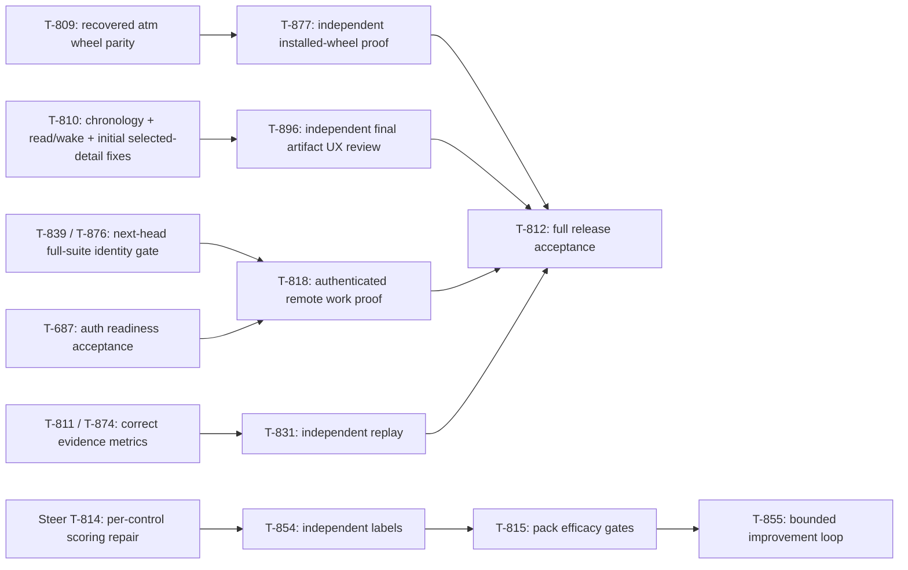

# Interim CEO launch desk — T-897

Operator decision, September 13: Sol takes interim CEO/master while Claude
leadership is session-limited. Runtime identity remains
`sol-planner-codex-0913`; no second Sol session or approval desk is introduced.
Previous CEO: `atman-ceo-opus-0913`. Previous CoS:
`atman-cos-sonnet-watch-0913`, currently quota-paused. Return leadership through
an explicit, recorded handoff after recovery; do not rely on old role names or
inbox read as proof of availability.

## Objective and product bar

Atman public September 18: primary `atm` CLI with `tickets` compatibility;
one coherent local app showing objective, terminal criteria, dependency work,
distinct teammates, review and message evidence; supported authorized wake
without operator keystrokes; executable README and initial truthful scorecard.
Steer releases only named policy packs/controls whose independently labeled
efficacy passes the accepted gates. No NER flip, self-approved compliance,
unmeasured savings claim or experiment that blocks launch.

Atman is the team runtime for agents users bring, not a Steer policy clone.
Keep formation dots, lowercase wordmark, flat charcoal/brass identity and
compact Work/Team/message surfaces. First Work screen answers what finishes,
what waits, and who is next. Evidence distinguishes reserved, posted, read,
woken, claimed, reviewed and accepted. Research/portfolio chrome is secondary.

## Current execution graph

This is the execution/acceptance relationship, not proof every drawn edge has
already been edited into the live board. The board remains authoritative.
Do not create a second ticket registry or duplicate the existing units.

## Active owners and endpoints

- **App:** `atman-ui-t810-cursor-0913`, unique author. T-810 correction is
  IN PROGRESS. `38819eb` ignores every equal-second post, including newer ones;
  repair real ordering or report ambiguity. Independent reviewer found two
  additional issues on `d92d064`: wake label erases inbox-read evidence, and
  initial deep-link selection does not bind mobile jump/compose. Fold genuine
  failures into one new candidate, then verify its exact SHA.
- **App review:** `atman-ui-review-cursor-t896-0913`, independently claimed
  T-896 after its first run safely stopped on inherited identity. Report
  `b3a61e8` is FIX on `d92d064`, not an acceptance of a newer head. Preserve
  findings and perform narrow correction confirmation; final consequential
  acceptance also requires one clean full suite with relative baseline evidence.
- **CLI:** `atman-atm-recovery-cursor-t809-0913`, exclusive recovery owner.
  Prepared from prior Claude `3a585b6` plus its two unfinished author files;
  the original worktree remains untouched. Finish wheel parity and old hooks
  proof, disclose unsupported packaged commands, commit/push an exact artifact,
  then T-877 independent verification. Do not treat old `a8a48f3` as current.
- **Agy:** T-819 owner `agy-pm`, T-824 owner `agy-mail`. Their recurring
  five-minute partial-output watcher loops were stopped from relaunching;
  checkpoints requested, ownership retained. Resume one explicit bounded task
  when capacity frees, using a sufficiently bounded execution/continuation
  policy rather than restarting on every partial timeout.

Each active Cursor launch is task-only, maximum one run and twenty-minute run
timeout. Both `TICKET_AGENT` and `TICKET_SEAT` are pinned to the unique worker
in its scoped execution command; inherited provider session variables stripped;
worktree hooks scoped and private files excluded from git. Never bake worker or
leadership identity into user-global hooks. Explicitly prefix both variables on
every board call if the harness overwrites ambient state. Canonical `cursor`
must not absorb another worker's ownership or messages.

## Merge and measurement rules

T-876's prior ACCEPT of `2a942f0` was explicitly overturned by Opus after
clean-env regressions. PR #116's current remote head is `236db12`; it is not
accepted by the old verdict. Do not merge it or the app on stale evidence.
Consequential verification runs the full clean suite once and compares failures
with matching main/base; focused author passes alone do not mean ACCEPT. Reuse
trusted exact-baseline receipts to avoid repeated suites. Known main debt is
documented separately, never permission to ignore a candidate-specific failure.

Engineering completion requires independent artifact acceptance, required gates
and reviewed-content verification on the target main. App deployment/live
objective completion remains separate. Sandbox research success is not merge
or production DONE. Metrics keep unknown USD/tokens/ACK/coverage null; total
cost includes worker, repair, reviewer and coordination. No ACK-only wake loops,
paid unchanged-state pulses, arbitrary quota clearing or silent reassignment.

## Communication and recovery

Use the shared board CLI with your unique agent and seat, and the configured
shared board path. Directed work uses `tickets msg --task --to <runtime> --re
<ticket>`; ordinary messages start only appropriately enrolled continuous seats.
Check `tickets inbox` at milestones. Report one changed fact, blocker or artifact
pointer. Delivery/watch poke is not an explicit response or work start.

Successor reads this packet, the live objective/roles, T-897's latest notes,
and current T-810/T-809/T-896 artifact/owner state before acting. Checkpoint
active work, preserve exact verdicts and originals, choose one useful next
action. Do not bulk reopen quiet workers, delete foreign branches or spawn
another permanent leadership team. Optional T-894 orchestration pilot waits
behind release work and available account allowance.
