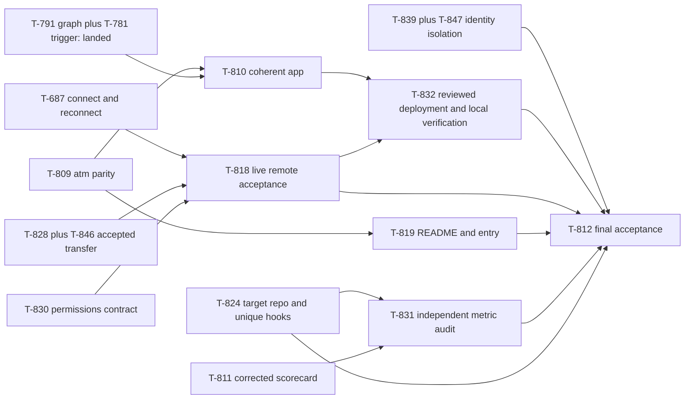

# Atman launch plan · September 18

Owner: Sol (`sol-planner-codex-0913`). Decision owner: Opus CEO. Execution and blocker owner: Sonnet CoS. T-853; board snapshot September 13, 2026, 10:05 Singapore time. Proposed scope and graph edits below are not applied by this document. The operator's revised objective supersedes the September 16 options in T-852.

## Promise and first win

**Bring the agents you already use into one working team.** Give them an objective, separate identities, a shared work graph, messages and a review path. See what is waiting, what is working and what actually finished.

The first win is a small, real delivery loop: join two distinct seats; plan A → B; finish and independently accept A; observe B start without a second operator instruction; inspect B's inherited handoff and final reviewable artifact. An explicit task can start a task-only seat; ordinary messages cannot. A continuous seat can act on an authorized message. The graph never turns a failed, held or merely submitted change into permission to release a dependent.

Atman's philosophy is concrete: an agent's intelligence is useful when it receives the right context for the work in front of it. Preserve each seat's identity, give it a bounded task and relevant decisions, and leave a verifiable handoff when it finishes. A successor inherits the work rather than repeating discovery. The ticket graph records execution; team knowledge records reusable decisions and artifacts. They are connected layers, not interchangeable stores. KV/latent research is not a launch dependency or a product claim.

Use Claude Code, Codex, Cursor, then Grok/custom remote in client examples; Agy gets its actual adapter path. This is not a Claude-only first seat. Advertise native, supervised and bridge transports separately. “Persistent” describes lifecycle, not proven reachability or unlimited autonomy.

## Lessons to adopt, adapt or reject

These are product decisions informed by sources, not claims of parity or Atman performance. Reuse [the existing Stripe/Ramp receipt](../research/stripe-minions-ramp-inspect.md); its permission-bypass analogies do not authorize bypassing Atman's review or host permissions.

| Source and evidence | Decision | Concrete `atm` / app behavior | Existing owner/ticket |
|---|---|---|---|
| Stripe Minions: unattended work ends at a reviewable PR; deterministic checks surround the agent loop. | Adopt the reviewable endpoint and bounded verification. | Each engineering node has acceptance criteria, exact candidate SHA and independent verdict. “In review” is visibly distinct from “Done”; authoring a PR does not release gated children. | T-781, T-810, T-812 |
| Ramp Inspect: verification uses the engineering environment, and sessions can be inspected across clients. | Adapt verification and inspectable state. | Artifact/check links on a node; browser evidence for UI work; one board identity across CLI/app. Reconnect shows actual enrolled runner and recovery action. | T-687, T-810, T-832 |
| Stripe/Ramp hosted machines, proprietary integration stacks and one-company agent loops. | Defer hosted fleets; reject copying their harness into Atman. | Local app and existing runners first; isolate worktrees. Vercel public product site does not expose the operator's private board or masquerade as a live hosted team. No blanket permission bypass. | T-824, T-819, T-832 |
| Cursor Projects: a responsive coordinator delegates execution, maintains reusable project context and subscribes to work signals. | Adopt role separation, inherited artifacts and event-driven work. | CEO owns objective/decisions, CoS removes blockers, Sol scopes strategic questions, workers implement. Show objective, graph, team and channels as one app. Targeted messages carry useful context and distinct delivery/work evidence. | T-810, T-818, T-819 |
| Cursor scaling research: flat coordination caused contention/drift; an extra integrator role became a bottleneck. | Adapt bounded ownership; reject another mandatory approval desk. | One implementation owner, one independent verifier and one named merge executor. Workers resolve their own conflicts. Batch delayed messages; no paid “unchanged” pulse. Atomic claim remains necessary; do not replace it with informal file coordination. | T-848 guidance; T-824, T-828, T-839 |
| Google scaling study: coordination helps some decomposable tasks and harms some sequential ones. | Adopt task-dependent parallelism; reject “more agents is better.” | Parallelize independent UI/docs/metric work; keep authorization and identity gates explicit. Compare task families with equal success criteria before claiming better routing. | T-811, T-831 |
| Operator's “graph engineering post.” | Source unresolved at this snapshot; no attributed claim yet. | Real dependency edges and success-trigger evidence already have operator requirements and shipped T-781/T-791 evidence. Do not invent a URL or restaff those implementations. CEO asked for original artifact; append confirmed source and any additional behavior once identified. | T-853 source follow-up |

Primary sources: [Stripe Minions](https://stripe.dev/blog/minions-stripes-one-shot-end-to-end-coding-agents), [Ramp Inspect](https://builders.ramp.com/post/why-we-built-our-background-agent), [Cursor Projects, September 10](https://cursor.com/blog/projects), [Cursor scaling research, January 14](https://cursor.com/blog/scaling-agents), [Google scaling study](https://research.google/blog/towards-a-science-of-scaling-agent-systems-when-and-why-agent-systems-work/). Cursor Projects and scaling posts and Google source checked September 13. Stripe/Ramp details reuse the September 11 receipt. Vendor throughput and cost figures are not Atman metrics. Older local roadmap wording against “task graph” on the landing is superseded by the operator's explicit visible-work-graph requirement; keep public language simple: “See what starts next.”

Source distinction: existing T-806 acceptance contract calls its Cursor input “Cursor Chief of Staff Operational Rules & Evidence” (local board guidance), not an external architecture article. The two primary Cursor posts above are separately verified relevant references; they are not asserted to be the operator's original notes. Bounded artifact lookup found no unambiguous graph-post URL. CEO clarification requested on T-853; this is the only unclosed source-attribution item, not a reason to block already specified implementation.

## What the board actually says

| Work | Snapshot | Launch implication |
|---|---|---|
| T-806 acceptance / T-807 onboarding / T-801 missing-data lock | DONE | Build from these contracts. Targets and proposed adapters are not automatically measured capability. |
| T-781 success-trigger backend | DONE (`d88a4ca`) | Reuse, then independently verify live child work. A task message/receipt is not proof of a running child. |
| T-791 Work graph UI | DONE, reported on main `5373cbf` | Reuse graph payload/UI. T-796 is its BLOCKED duplicate; do not reopen or count it as a second deliverable. |
| T-809 primary `atm`, compatibility `tickets` | IN REVIEW, old PR #113 `a8a48f3` | Rebase and verify current source + installed wheel before merging. One implementation and one board. |
| T-828 transfer / T-839 identity boundary | IN REVIEW; independent T-846 ACCEPT `b47e7cc`, T-847 ACCEPT `7fbae42` | Integrate exact corrected candidates with preserved gates. Old PR #108 / superseded PR #114 pins are not the accepted changes. |
| T-824 explicit cross-repo spawn | IN PROGRESS | Verify repo + base + unique hook identity together. Do not spawn Atman work from a Steer-derived worktree. |
| T-687 connect/reconnect | TO DO, reserved identity not yet proven live | CoS staffs one actual Atman console worker. This is a real dependency of remote acceptance. |
| T-818 remote work start | TO DO, gated by T-687/828/830/846 | Freeze scopes and states, integrate transport, then test from separate client. Resolve current role holder, never hard-code retired CEO ID. |
| T-850 seat migration / T-851 Claude settings | IN REVIEW | Sol identity migrated. Stale global Claude hooks removed; real CoS enrollment still lacks native endpoint. File repair and `woken` transport receipt are not idle work-start acceptance. |
| T-811 scorecard / T-831 independent audit | IN PROGRESS / gated | Seven T-811 provenance defects are FIX. No public efficiency comparison until corrected event-level baseline is independently accepted. |
| T-810 app / T-819 OSS surface / T-832 release / T-812 final acceptance | TO DO, serialized | Proposed parallel cuts below; final release still requires all promised behavior. |

Fetch current refs and inspect current board before executing a merge or assignment; these are evidence snapshots, not durable leases.

## Proposed launch graph

Solid edges below are the proposed required inputs. This is a plan, not a CLI mutation. Existing completed contracts are omitted for readability. Final acceptance includes UI integration, documentation, live remote/auth, identity, explicit repo spawning and the independently audited metric baseline.

T-810 can implement from frozen onboarding/permissions/metric schemas while T-818 and T-831 finish. It must integrate their accepted implementations before final browser acceptance. T-832 can prepare deployment and public previews early, but remains gated for its final remote/version smoke verdict. Do not relabel a static preview as the complete product.

### Ticket edits for CEO approval and CoS execution

1. **T-819: drop T-818 as a start dependency; retain T-809.** README preparation does not require remote work to be finished. Capability labels and exact commands must reflect evidence; final T-812 checks them against live remote behavior. Current T-784 documentation predecessor is already merged. Scope root cleanup to the primary contribution path; do not delete historical evidence or foreign branches.
2. **T-810: drop T-819 and T-831 as start dependencies; retain T-809 and frozen contracts.** Reuse landed T-791/T-781 and T-801 unknown lock. Add explicit integration checklist for T-687/818 and accepted metric data rather than serialized implementation. Keep T-831 in T-812 release gates. Do not disable missing functionality and then declare final app success.
3. **T-796: retain duplicate/remake status pointing to DONE T-791.** Fold any UX revamp into T-810. No new graph backend or planner.
4. **T-818/T-812: replace retired CEO name and September 16 deadline with current role-resolved runtime and September 18 objective.** First live slice targets the current CEO harness; Codex Sol remains a required independent supported-harness case. A displayed queued message does not pass. T-851 enrollment limitation stays on the live acceptance checklist.
5. **T-812: update stale reservation to one independent current verifier; retain security/identity/spawn/metric/doc/deployment dependencies.** Real transport matrix must name tested client/version, active versus idle, native/supervised/bridge and an observed ACK + work action. No universal Grok-native claim from a local wrapper unit test. Add T-830 accepted authorization and T-687 recovery acceptance explicitly to checklist; they remain transitively gated through T-818.
6. **T-811/T-831: use metric/label contract below.** Repair original seven defects; don't create seven competing scorecards. Relocate accepted implementation/artifact to Atman, pin source snapshots/digests, audit each KPI independently. Present per-KPI missing coverage rather than delaying UI layout.
7. **T-832: retain final T-810 and T-818 gates.** Prepare Vercel assets/link checks in parallel; record URL → SHA, local board evidence and rollback before DONE. Neither a deploy URL nor a clean git merge alone completes the app promise.

Do not apply these from this doc with blind numeric-ID rewiring: CoS checks current edges, actor ownership and later CEO decisions first. No duplicate implementation tickets needed. T-773/T-774 remain HOLD; learned router, KV research, hosted fleets and backend language migration are not this release's critical path.

## Product and UX acceptance

The first screen answers: “What are we trying to finish?”, “What is blocking it?”, “Who is doing the next step?” Objective and terminal success criteria sit above the Work graph. Each node shows real status, owner, waiting-on reason and artifact/verdict; selecting it reveals acceptance criteria and the handoff. A completed parent shows why its child became ready and whether that child actually began work.

Team separates unique runtime ID from stable role and displays lifecycle, provider/model when known, enrolled runner, auth state and last useful action. Channels show recipients, access scope and evidence-backed message state. “Queued” has a reason and recovery action. Do not manufacture “acknowledged” from inbox reads or “working” from heartbeat. Keep “Send message” and “Assign task” distinct, with visible task-only/continuous semantics and safe default permissions.

Metrics show measured counts, windows and unknown coverage beside the number. Empty/new boards show — and a useful first action, not fabricated charts. Preserve Atman's established visual identity rather than copying Steer. Prefer a graph and compact panels over an endless marketing scroll; keyboard-accessible list alternative, reduced motion, readable contrast and mobile follow-up are acceptance cases. This is a scoped product review, not a claimed live browser inspection.

Suggested README lead: “Atman brings your existing AI agents into one team: a shared objective, a work graph, messages and review, with a separate identity for every agent.” Follow with an executable install → `atm` join → app → A → B example, transport support matrix, short philosophy, architectural map and contribution path. Fewest-turns is an optimization objective; measured improvements require evidence. No localhost-only public CTA, unproved five-minute guarantee, research section or compliance promise.

## Efficacy metrics and labels v1

This extends existing [turns](../turns.md), [trajectories](../trajectories.md) and [coordination/success](../onboarding/coordination-and-success.md) semantics without renaming their schema-v1 keys. T-801 unknown lock, T-811 source corrections and T-831 independent verification remain authoritative. Required linkage not present in a source is a proposed instrumentation gap, never an inferred event.

### Common measurement rules

- Pin a half-open UTC window `[start,end)`, board/release identity, immutable source snapshots and digests, parser/contract version and export command. Reconstruct outcomes as of cutoff; later mutable ticket status cannot leak into a prior week.
- Pin eligible cohort at start or enrollment event. Report eligible, observed, missing, excluded with reasons, still-open and matured-by-deadline separately. Missing required linkage does not silently shrink the eligible denominator. Undefined ratios are null. Never turn unknown into success, failure or zero spend.
- Split harness, model/effort, execution context, task family/size and transport; unknown fields stay unknown. Provider/harness cost and productive board runs are separate dimensions. Historical backfill cannot establish native model turns or remote work start.
- One engineering work unit meets its criteria, has independent exact-SHA ACCEPT plus required checks and verified target-main content. Repairs/retries/extra PRs are attempts on that unit. Deployment and live objective completion are separate labels. Post-merge defects revise reliability evidence without erasing the historical merge event.
- Every KPI exports event IDs/source locations for numerator and denominator, missing links and label provenance. Reviewer-coded outcomes pin rubric, coder and adjudication; textual absence is not a label. Freeze measurement definition before looking for a favorable rate.

### Nine core KPI contracts

| KPI | Unit, eligible denominator and positive evidence | Missing-data and failure rule |
|---|---|---|
| Activation | New unique seat enrollment sessions; activated if identity/role, runner/auth, objective briefing, message check and first permitted bound-task action all link to that session. Report within-five-minute rate plus time distribution where timestamps exist. | `join` or heartbeat alone isn't activation. Five minutes is a proposed benchmark target, not measured promise. Missing step evidence = unmeasured; elapsed inactive sessions remain open/expired, not excluded. |
| Time to first claimed ticket | Enrolled eligible worker sessions with a ready permitted task; elapsed enrollment → its first valid claim. Report ready-at-join and later-ready cohorts separately. | Leadership seats/no-ready-task sessions are explicitly ineligible; auth-paused and eligible nonclaimers stay visible. No closed-only median sold as whole-cohort speed. |
| Directed-message delivery / ACK / work | Unique authorized directed messages/tasks to enrolled targets within a predeclared observation horizon. Separate durable enqueue, client delivery, explicit message-linked ACK and task-linked agent work start. Report idle/active and transport separately. | Inbox access, empty inbox, transport receipt or unrelated activity isn't ACK/work. Pending/not-due and expired/failed distinct. Zero-keystroke acceptance records operator intervention count; retries share one idempotency unit. |
| Task completion | Frozen claim cohort and maturity horizon; independently accepted work-unit merge by cutoff for engineering, rubric-defined terminal proof for other work. Report objective completion separately. | “Review” and DONE without required artifact/gate aren't engineering success. Still-open cohort, cancelled/excluded reasons and missing verification remain visible. Capture conversion/maturation, not only finished tasks. |
| Productive runs to accepted unit | Existing T-425/T-481 productive paired watch-run count from first claim through accepted merge, including repairs; publish comparable completed-cohort median and missing count. | One board run is not one underlying model turn. Nonproductive paid runs don't count here but their known cost/time belongs in overhead. Complete coverage required for total-turn comparison; partial observed count is a lower bound. |
| Elapsed time | First valid claim → accepted outcome; separately enrollment/queue, active execution, auth/offline pause, review and merge waits where interval events exist. | Missing components null; overlapping parallel durations aren't summed as wall time. Open tasks show age/right censoring, not made-up completion time. |
| Cost | Harness-reported cost for linked worker/retry/reviewer/CEO/CoS runs; accepted units per observed dollar and full cost/unit only on fully attributed cohorts. Show coordination separately and include it in total. | Missing actual cost null. Observed partial cost is a lower bound with coverage. Token × pinned rate is a labeled estimate, subscription plan spend is distinct. Shared coordination uses a declared allocation or stays unallocated; no arbitrary fallback USD. |
| Review rework | Units with observed first review-entry events and a linked independent verdict: first-review ACCEPT rate, FIX cycles and post-merge defect count. | Every DONE isn't a reviewed unit. Missing verdict/candidate linkage unmeasured; exclude nonreview work explicitly. One correction cycle can have several commits, not several successes. |
| Avoided rediscovery / inherited handoff | Successor task episodes receiving a specific earlier artifact/decision; reviewer rubric verifies correct reuse without repeating the relevant discovery, with outcome evidence. | Absence of “rediscover” or presence of a link isn't proof. No artifact/task linkage or no coded rubric = unmeasured. Show knowledge-use coverage separately; paired comparison needed for avoided-cost claims. |

### Labels and replay requirements

Persist or export only supported evidence with explicit provenance. Proposed label vocabulary: `activation_complete|partial|expired|unmeasured`; message `sent|queued|delivered|acknowledged|working|review|failed|expired` with separate cancellation/revocation reason; outcome `accepted_merge|accepted_noncode|in_review|blocked|open|cancelled|unverified_done`; cost `reported|estimate|partial_observed|unmeasured`; knowledge `verified_reuse|repeated_discovery|incorrect_reuse|unmeasured`. These are scorecard/UI labels, not permission to invent new underlying event kinds or overwrite historical CLI status.

Current productive-run pairing uses `run_id`, with documented legacy `(agent,run_no)` fallback; no backfilled model turns. Required joins include board ID, unit/ticket ID, runtime/session and provider provenance, message/task nonce/idempotency ID, exact candidate/merge evidence and event time. Where not emitted, T-811 must identify the gap and leave the KPI null. As-of replay and source digest are mandatory for weekly claims.

Independent audit cases: missing ACK despite inbox read; unrelated worker update; delayed message past window; review without verdict; DONE without review; later mutable status; no-token/no-rate cost; partial cost; parent/worker identity collision; retry/idempotency duplicates; open claim cohort; repeated work despite a context link. Each must fail the fabricated inference while preserving eligible/missing counts. These directly exercise the seven existing T-811 FIX defects, not tests that merely mirror presentation.

### Release floor and first improvement cycle

Proposed release floor: every promised control has independent exact behavior evidence; repeatable fresh-board A → B run; authorized separate-client directed work start with zero operator keystrokes for each advertised transport; duplicate/retry/revoke/task-only denial cases pass; nine KPIs have ACCEPTed definitions/provenance/missing rules and a reproducible initial snapshot. A baseline may honestly contain null KPIs; observed native-work, identity/security and the real first-win proof cannot be waived as missing telemetry. No cost-savings or agent-ranking claim until comparable full attribution exists.

Before efficacy claims, fix any disputed T-811 inference and T-831 verdict. Then run a frozen small task-family suite comparing manual agent handoff to Atman-assisted handoff under the same models, acceptance gate and budget. Record all failures, coordination, interventions and elapsed/cost coverage. A dozen matched episodes can validate instrumentation and expose errors; it is not a robust “X% cheaper” launch claim. Use paired outcome data and uncertainty before choosing a routing improvement; the old shadow route agreement is observational, not a counterfactual benefit.

Weekly: one dominant measured error slice → one small change → preserved success/security criteria → matched rerun → before/after with cohort and missing coverage. Useful targets are fewer operator interventions, identity failures, duplicate paid actions and review cycles while preserving completion quality. Publish dollar improvements only when measured. Do not create unrelated optimization work just to grow sample size.

## Date protection and stop conditions

| Date | Concrete endpoint | CEO decision if absent |
|---|---|---|
| Sep 13 | Approve graph cuts and promise; CoS staffs one worker per ready lane; exact corrected identity/transfer integrated; source clarification recorded. | Resolve owner/transport blockers once; do not spin another planner/merge desk. |
| Sep 14 | `atm` source/wheel parity accepted; UI and README working in parallel; actual CoS/CEO/Sol transport matrix captures idle + active results; metric corrections submitted. | If native transport unavailable, choose a genuinely supported supervised/bridge implementation and label it; cannot substitute manual inbox consumption for promised automatic work. |
| Sep 15–16 | Coherent app browser candidate, auth/reconnect + separate-client work proof, independent scorecard replay. | Freeze features; repair only failed promised behaviors. No learned routing, fleet or language-migration expansion. |
| Sep 17 | Independent clean-machine / live acceptance T-812, deployed SHA and rollback T-832, fresh-reader README trial. | If critical behavior fails, state exact blocker and revise release scope/date explicitly. A preview is not the objective. |
| Sep 18 | Public product release with truthful client support, executable entry path and initial measurement snapshot. | CEO release verdict; CoS records deployed revision, residual debt and next measured improvement. |

Steer: the revised T-854 labels → T-815 efficacy → T-855 improvement loop stands. Two cautions: seal and blind predictions; model-assisted independent reviewers do not imply domain/legal review. Repeated optimization against a revealed holdout destroys independence: keep a development slice for fixes and reserve new sealed confirmation for release claims. Scope gates by the named control/family, retain eligible missing predictions and severe-miss budget; “no agreement” is NO_GO, not a favorable relabel. No NER flip, new action or bypass of T-833 thresholds is proposed.

## Critical gap analysis · complete Cursor synthesis

CEO requested this follow-up September 13 at 10:17 after approving the original plan. Input: the complete 2026-09-13 [Project notes-blog synthesis](</Users/kavana/.cursor/stores/bc-2583b104-3473-4c55-b0e1-2104d477784c/docs/notes-blog.md>), including its source index and unresolved-input section; input SHA256 `68fb3111dcc45072078fc5a6008441f20e5c2ef9d6604545fa585f580636c577`. Reviewed relevant underlying coordination, graph/wake/install, AIRA2, Tardigrade, FrogNano/frontier and metric receipts. Those notes are historical evidence, not a substitute for current runtime verification. Research method/vendor descriptions with missing primary inputs are treated as hypotheses, not newly verified facts.

Current code baseline for this assessment: Atman `origin/main@3679053`, also the installed `tickets` target in `atman-runtime-current`. The primary `/atman` checkout itself is on an unrelated branch and is not used as the baseline. In this planner's execution environment `atm` is absent from PATH; T-809 remains IN REVIEW. Source inspection is not a clean-wheel, browser or model-execution test. Current board deltas: T-856 global-hook prevention IN REVIEW `bc6f69a`; T-857 reachability repair reopened IN PROGRESS after CEO requested a real WebSocket handshake/thread-loaded gate; T-811 author now reports work on the seven existing corrections. These are not accepted fixes yet.

### Graph-post attribution verdict

**Unresolved; none of the three candidate URLs is confirmed as the operator's original “graph engineering post.”** The complete synthesis explicitly says no standalone Graph Engineer / Graph Engine / Grapheneer note was found. Its Graph Engineer section derives its claims from our launch plan, product system and local graph receipts. That is not independent attribution.

- [Cursor scaling-agents](https://cursor.com/blog/scaling-agents): verified relevant planner/worker architecture research; not evidence that this was the named graph post.
- [Google scaling study](https://research.google/blog/towards-a-science-of-scaling-agent-systems-when-and-why-agent-systems-work/): verified relevant task-dependent coordination research; not a Graph Engineer artifact.
- [Cursor Projects](https://cursor.com/blog/projects): verified coordinator/product-context reference; not a confirmed original graph post.
- A separate primary source, [Fatih Arslan's How I manage my agents](https://arslan.io/2026/09/11/how-i-manage-my-agents/), is named in the linked coordinator/Fatih notes and was checked in full September 13. It discusses plan capture, cause/change/proof, dispatch, merge sync, coordinator handoff and retro. This is an identified source, but still not proof that it is the operator's missing graph reference.

Do not describe our own synthesis as confirmation of a missing primary source. Original URL or operator confirmation remains the attribution exit condition. Existing executable-graph requirements are independently specified and need not wait on it.

### Evidence anchors

Line references below refer to the baseline above, not the future merged candidate:

- **E1 — File-board delivery path:** `tickets.py:1435` atomically claims ready-lane tickets; `:1524` unblocks by dependencies whose status is DONE; `:2428` builds workflow graph; `:2687` starts successors; `:2724` next/claim hands off context; `:4873` DONE records state and calls successors. `_start_successors` reports “started” for an unassigned child even though no target is messaged, and for an assigned child after posting a task, without observing execution. This is a concrete state-label gap.
- **E2 — Review paths differ:** `tickets.py:2845` pins source review; `:4873` checks repo/worktree and records DONE but does not itself require an independent ACCEPT and verified main merge. The scoped API does enforce non-author review in `src/ticket_board/server/app.py:641`; `storage/board.py:1220` pins evidence SHA/checks and transitions accepted review to DONE. Neither distinction should be flattened into “no review exists” or “every DONE proves a merged change.” CLI live-board review/merge is also a desk procedure. T-810 must identify the authoritative path used in its actual app and T-812 must verify that path.
- **E3 — Wake and overhead:** `tickets.py:8568` distinguishes pending direct/task messages; `:8657` explicit tasks wake; `:8673` continuous-message gate suppresses review/receipt/ACK/idle prefixes. This reduces some loops but does not semantically deduplicate every delayed message. T-850/T-851 record actual native enrollment; T-857 is still correcting reachability versus transport evidence. A socket, “persistent” label or `woken` receipt cannot establish automatic model work.
- **E4 — Knowledge already exists:** `tickets.py:1650` dependency handoffs; `:9780` provenance/revision/verification schema; `:9891` staleness; `:9940` dedup; `:9951` keyword/scope/one-hop selection; `:10013` bounded rendering; `:10053` task-selected context; `:9520` prompt injection; `:10156` knowledge query/validate. `:9576` attaches knowledge references to a ticket; graph stays outside `.tickets`. `docs/knowledge/inject.md` documents the selector. T-771 audit found 15 nodes/16 edges, 10 nodes GLiNER-centric and unrelated GLiNER inheritance on UI task T-726. Packaged `src/ticket_board/cli.py` lacks the corresponding root knowledge command/injection surface; actual installed entrypoint parity needs evidence.
- **E5 — Trace limits:** `src/ticket_board/trajectories.py:125/:213` supplies analytical append-only events, best-effort recording and omitted prompt/tool bodies. `server/events.py` has SSE audit replay/snapshot recovery; `storage/board.py:196` retry dedup. This is useful event/audit infrastructure, not deterministic reconstruction of every agent/model/tool state. No general runtime failure-mode judge is established by this inspection.
- **E6 — Metric/deployment evidence:** T-801 merged unknown lock; T-811 seven independent FIX findings and T-831 uncompleted audit; T-809 source/wheel install outstanding; T-810 coherent app and T-832 final deployed-SHA/local-board acceptance outstanding. Earlier parser, wake, UI, quota and HTTP receipts retain their dates; later accepted fixes supersede earlier breakage, while old successful receipts cannot establish current uptime.

### Decisions for every synthesis idea

Effort/risk bands are planning estimates, not measured implementation time: low = checklist/copy/small existing-path change; medium = focused correction plus independent verification; high = new infrastructure or broad state migration. “Now” attaches to an existing ticket and named launch acceptance; it is not permission to add an unbounded feature.

| Idea from synthesis | Actual gap / evidence | Named benefit or reason it does not help | Cost, date risk and decision |
|---|---|---|---|
| Persist to reviewable artifact, close tests/log/screenshot loop | Existing branch/SHA review E2; live browser and exact deployed evidence incomplete E6. | First-win accepted artifact; completion, elapsed, first-review rework. | Low incremental acceptance work. **Now:** strengthen T-812 evidence checklist; don't build another agent loop. |
| Accepted A starts B; failure/HOLD/submission cannot | Existing DONE trigger E1; “started” is asserted from dispatch/readiness. Required engineering review/main evidence is not intrinsic to this file-board trigger E2. | First-win loop; genuine work-start and accepted completion. | Medium correction if probes fail, critical to promise. **Now:** separate ready/dispatched/working and test required acceptance path; reuse T-781 via T-810/T-812 rather than remake backend blindly. |
| Isolated workers, asynchronous specialists, strict task scope | Claims/worktrees exist E1; cross-repo base/hook leakage remains T-824/839/828; HOLD filter already landed. | Completion, activation, rework, identity-error slices. | Medium existing repair. **Now:** finish current identity/spawn gates. More seats by themselves are **rejected** as an improvement. |
| Planner/coordinator separate from workers; one owner/verifier/executor | Role split and T-848 desk guidance already exist; stale assignment/ACK repetition still costs turns. | Coordination cost, rework and elapsed wait. | Low procedure cost. **Now:** apply existing desk rules; do not add another required Sol review or integrator. |
| Meaningful-event wake, client evidence states, lifecycle versus reachability | E3 native enrollment fixed, idle-start/work proof incomplete; T-857 active repair. | Directed delivery/ACK/work and operator intervention count; first win. | Medium repair on existing lane, launch-critical. **Now:** real active/idle transport matrix and T-857 verification; no new watcher fleet. |
| No paid unchanged pulse; bounded retries / dedup | Prefix suppression exists E3; delayed prose can still wake continuous seats; transport retry not semantic work dedup. | Cost/unit and coordination productive-run burden. | Low policy/acceptance; broad semantic classifier risky. **Now:** batch by ticket + event/SHA, one response per actionable outcome and test retry/receipt loops in T-812. **After launch:** semantic classifier only if measured residual warrants it. |
| Reusable context travels with work; separate identity/role/harness/model | Existing handoff and typed fields E1/E4; knowledge parity/relevance insufficient; T-839 boundary independently accepted but needs integration. | Activation, discovery/rework, accepted completion. | Medium existing coverage. **Now:** scoped T-771 evidence and T-824/839 integration. No new global identity variable shared across children. |
| Real graph edges, status, blocker/owner, node detail | Landed T-791 graph E1; T-810 still needs coherent node details and execution-evidence distinctions. | First-win clarity; time to first claim, completion and elapsed. | Low/medium UI integration. **Now:** reuse payload, render criteria/handoff/verdict, keyboard list fallback. Decorative canvas/category rewrite **rejected**. |
| Work graph distinct from reusable knowledge graph | Already separate E4; product UI/copy can conflate execution state and useful inherited knowledge. | Avoided rediscovery rubric; first-win handoff. | Low copy/reference work. **Now:** T-810/T-819 display relevant sources without claiming automatic memory or full utilization. |
| Parallelism only for separable work | Dependency rules exist, but “parallel agents” doesn't measure benefit; sequential same-file work carries review/merge cost. | Completion/elapsed/quality at equal budget. | Low scheduling discipline. **Now:** keep approved UI/docs/metric parallel cuts. **After launch:** matched task-family routing experiments. No universal speedup claim. |
| AIRA2 ReAct/hypothesis→action→evidence→revision | Native harnesses already own their reasoning loops; missing AIRA2 first pass and broad unsupported descriptions in second-seat note. | Atman benefits from artifacts/decisions, not owning the inner loop. | **Now:** cause/change/proof and independent result verification through existing tickets. **Reject:** new ReAct runtime or academic Rocket integration. |
| Frozen labels/hard negatives/HOLD and stable eval | HOLD/regression framework exists; current Atman operational baseline isn't independently validated E6. | Completion and false successful-state/rework labels. | Low existing audit. **Now:** T-811/T-831 adversarial replay + frozen definition. **Reject:** moving gold or claiming Steer's frozen pack score as Atman efficacy. |
| Astra quality per cost; precise triggers, on-demand guidance, define done | Existing productive-run and context paths E3/E4; costs and full comparability lacking E6. Missing exact Astra setup cannot be reconstructed. | Cost/unit constrained by accepted success; discovery and context load. | Low/medium existing fixes. **Now:** small primary `atm` entry, bounded handoff and known telemetry. **Reject:** vendor configuration/branding or SDK/skill-runtime clone. |
| Tardigrade immutable log, projections and full actor recovery | Analytical events and API replay exist E5, but full model/tool state is absent; current file board is mutable. | Potential recovery time and duplicate-tool cost improvement, not presently measured. | High state/harness migration threatens date. **After launch:** failure-specific recoverability prototype if evidence justifies it. **Reject for v1:** actor algebra rewrite, full deterministic-agent-replay claim. |
| Componentize budget/compaction/permissions/tools, colocated/remote children | Harnesses own many components; enrolled-runner safety and repo identity still need acceptance. | Potential cost/time/context improvements; no measured causal effect yet. | High integration/permission risk. **After launch:** one harness adapter ablation. **Now:** runner/permission evidence already in T-687/824/812. No framework migration. |
| Trace→failure modes→judge bundles/rewards | Logs support sampled offline review E5, not automatic useful-knowledge or outcome judgments. | Review rework, directed work-start failure and discovery labels. | Low offline rubric; online judging adds paid turns and false reward risk. **Now:** small manual audit taxonomy under T-831. **After launch:** independently validated reusable judge; reject online auto-reward/self-approval. |
| FrogNano minimal tools, natural termination, compaction | Atman controls team handoff; native harness tool/finish behavior is not Atman's runtime. Current context relevance E4 needs smaller inputs first. | Discovery/turn-limit/elapsed/cost potential for small models, not proven here. | Medium harness experiments, outside launch first win. **After launch:** one fixed-budget adapter ablation. **Now:** bounded relevance only. **Reject:** copying Leaf, vendor benchmark or RL factory. |
| Learnability-frontier calibration, oracle/no-context controls, fixed heldout | Good research methodology; app onboarding/security regressions must be reliably correct, not selected at ~50% resolve. | Completion and fair post-launch router/handoff efficacy comparison. | Low methodology, expensive rollout pipeline. **Now:** freeze app acceptance cases and keep all failures. **After launch:** calibrated difficulty for learning experiments. Reject outcome-selected holdout and TaskPilot Docker farm. |
| Intel: 3–7-window context/verification tax; human review bottleneck | Directional graded discourse, not current customer outcome evidence. Team UI/accepted artifact linkage still unfinished E6. | Potential activation/elapsed/rework improvement. | Low UX/test scope. **Now:** concrete two-seat first win and one reviewer desk. **After launch:** customer workflow measurement; do not sell agent count as differentiation. |
| Intel: tasks/messages/parallelism/dashboard are parity; pinned cross-harness delivery is wedge | Many building blocks exist; integrated installed/live proof missing E6. Missing intel file and N/E competitor cells cannot establish uniqueness. | First-win clarity and activation, not a vanity category win. | Low positioning. **Now:** T-819 explicit product promise/support/evidence. **Reject:** “only platform,” swarms, universal wake and cheapest-router claims. |
| PMM: distinct Atman promise and coherent surfaces, capture versus local live app | Public capture and partial local UI exist; primary `atm` path and final deployed revision incomplete E6. | Activation/time to first claim; clear first win. | Low/medium existing app/docs/release scope. **Now:** T-810/819/832 cohesive executable journey. No copying Steer's hero, fake hosted board or localhost-only public CTA. |
| Metrics before optimization; null/— and full unit cost | Unknown lock landed; seven disputed T-811 inferences still under repair E6. | All nine KPI definitions and defensible future cost claims. | Medium current audit. **Now:** accepted source/window replay; observe retries/review/coordination. No dataset growth as cure for broken instrumentation. |
| Connect to one living board, self-register, verify current binary and usage | Existing join/connect E1/E3; source/wheel/PATH incomplete T-809, global-hook prevention T-856 open. Missing quota previously reported FAIL; it isn't necessarily failed login. | Activation, time to first claim, auth/offline elapsed. | Low/medium existing parity/identity work. **Now:** current-binary receipt and provider-scoped readiness; show quota availability unknown without inventing zero. Don't change quota gating silently. |
| Fatih capture→sound→dispatch→merge sync and portable coordinator notes | Capture/ready/HOLD and local commands landed E1; T-827 documents capture-until-sound; hard merge evidence is not universal across E2. | Completion/rework; avoids premature tasks and repeated rediscovery. | Low checklist/docs, medium if closure guard missing. **Now:** T-827 example and one authoritative board-to-merge acceptance path. **Reject:** separate plans repo or git inbox bus. |
| Fatih retro corrects/removes the rule behind repeated failures | Retro docs exist; actual recurrence/outcome measurement not automatic E5/E6. | Rework and coordination cost; discovery failures. | Low one-rule change after observed repeated defect. **Now:** fold offline error taxonomy into T-831; propose one scoped guidance fix. **After launch:** recurring validated loop, no always-on optimizer with no endpoint. |
| Product restraint: hosted fleets, tool catalogs, SDK fork, latent memory-brain | No new launch requirement supports these; each expands runtime/trust/infrastructure rather than the first win. | No validated nine-KPI benefit at present. | High date/cost risk. **Reject for v1:** tool shed, framework fork, shared-state replacement. Remote hosted runner optional after launch, not a false laptop-off guarantee. |
| Steer policy/DLP/pack and compliance-buyer ideas | Separate advisory API/customer workflow; irrelevant to Atman engine feature adoption. | None directly for Atman nine KPIs. | **Keep separate:** T-854/815/855 labels/efficacy loop and buyer validation; no Atman vault/gateway/compliance-monitor pivot. Missing intel/PMM files, founder access and willingness-to-pay remain unknown. |

### Adopt-now handback: proposed existing-ticket edits only

1. **T-810 + T-812 — Make A → B honest and verifiable.** Render **ready**, **task dispatched**, **agent working**, **in review**, **accepted**, **merged** and **deployed** from their own evidence; do not copy `_start_successors` “started” into a working indicator. On throwaway boards verify unassigned children are merely ready, assigned children start once, submission/FIX/HOLD cannot release a review-required child, and the specific app's authority cannot allow an author to self-accept a required review. Include exact main-merge verification for engineering success. If these probes show a code defect, attach the smallest correction to the existing graph/runtime implementation or one tightly bounded repair blocking T-812; no decorative graph remake or full storage migration. This is medium-risk and launch-critical, not a wording-only loophole.
2. **T-857 + T-856 + T-818/T-812 — Finish actual persistent reachability and identity prevention.** Accept T-857 only with real protocol handshake/thread-loaded semantics and active/idle nonce + work evidence; neither registered PID nor `woken` alone passes. Independently verify T-856 wrong-cwd/user-global guards on supported installed entrypoints, preserve custom hooks and cover child identity boundary with T-839. A confirmed CoS endpoint fixes enrollment only. Retired-seat forwarding is a visible routing receipt to a role-resolved holder, not proof of execution. Keep duplicate suppression/ordinary-ACK tests and one recovery action; don't create a duplicate persistent planner.
3. **T-771 — Deliver one narrow, useful knowledge path.** Use explicit knowledge references for the first-win successor and a few reviewed Atman auth/identity/wake/review runbooks. Freeze relevance cases including unrelated UI negatives; report selected IDs/revisions, relevance judgments, context characters and useful-hit/missing coverage. Verify root and genuine installed entrypoint behavior; if wheel parity is not supported, fix the supported path or label its limitation. Suppress irrelevant GLiNER guidance, avoid general retrieval redesign. Bound this to existing product audit and first-win context, not a launch-wide knowledge migration.
4. **T-811 + T-831 — Audit actual outcomes and usefulness.** Retain seven FIX corrections; add sampled frozen knowledge labels (`verified_reuse`, `repeated_discovery`, `irrelevant`, `unmeasured`) with task/artifact revision and reviewer provenance. Injection does not prove reuse. A small offline failure catalog covers auth, identity collision, queued-not-working, stale candidate, premature success and irrelevant guidance; classify observed samples, don't run paid online judges. Compare productive board runs and separately observed model turns, repairs/review/coordination, reported versus partial/estimated cost; do not convert acknowledged coordination into automatic useful work. Existing watcher FLAG may count a ticket-bound update as a productive run even when its prose is status-only; preserve that schema and expose the separate coordination category instead of silently redefining historical turns.
5. **T-809 + T-819 + T-827 — One executable onboarding and desk example.** Pin binary/runtime SHA plus genuine source/wheel behavior for `atm`/`tickets`; don't rely on old PATH receipts. Explain ready-to-dispatch versus capture/unsounded/HOLD, self-registration, role/harness separation and actual permission defaults. Follow the role-resolved current team, not the stale canonical-cursor/CEO commands in historical notes. README first win shows inherited context and independent review, with no unsupported cost or native-wake promise. Reuse approved start-dependency cuts; no extra product naming or global-hook installer.
6. **T-810 + T-832 + T-812 — Ship coherent local/live and public surfaces.** Public URL maps to reviewed SHA and executable entry instructions; local app uses one explicitly identified authoritative board and matching graph/message/metric sources. Channels, auth/reconnect and mobile follow-up expose only real permitted controls. Current landing capture is labeled as such. Keep source/browser/wheel/runtime/deployed verdicts separate and retain final accepted metric/security/identity/live-work gates. This builds on the approved launch graph, not another backend rewrite.

No new owner assignments or graph edits applied in this follow-up. CEO may approve these additions; CoS can staff and execute them on current tickets. Most are already within approved acceptance, so extend those checklists instead of generating six more planning tickets. Full replay, automatic learned routing/judging, general retrieval/compaction experiments and research clusters remain after-launch or rejected as shown above.
